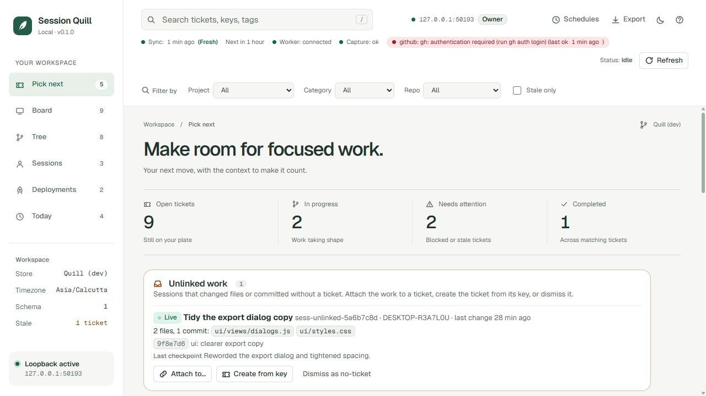
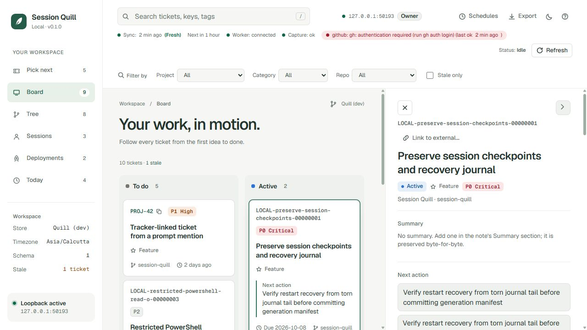

# Session Quill

[](https://github.com/nulllvoid/session-quill/actions/workflows/ci.yml)
[](LICENSE)


A Claude Code plugin that binds development sessions to tickets, keeps a durable local record of what each session did, and gives you a loopback dashboard that answers "what should I pick next?", "where was I?" and "what still needs deployment?".



- **Zero-command tracking.** Mention a ticket key such as `PROJ-123` in a prompt, or start on a branch like `feat/PROJ-123-...`, and the session is linked to that ticket. Any tracker works through a URL template; no tracker host is built in.
- **Unlinked work inbox.** Files and commits from a session with no ticket wait on Pick next. Attach them to a ticket, create the ticket from its key, or dismiss them; each action has a 10-second undo. Tracker keys open their ticket in a new tab and copy with one click.
- **Ticket gate modes.** `nudge` (default) never blocks and asks once at the end of a turn about unlinked work. `strict` denies supported write tools, unknown shell commands and unregistered tools until the session is bound, while dedicated reads and a tested read-only shell subset pass through. `off` only captures. The gate is a workflow aid, not a sandbox: `/session-quill:ticket off` disables it per session, audibly.
- **Durable capture.** Hooks persist events to local ingress before acknowledging; one worker per store journals them, rebuilds generated state, and writes markdown notes (plain folder or Obsidian vault) within 30 seconds. Your own Summary and Notes sections are preserved byte-for-byte.
- **Dashboard.** Pick next, Board, Tree, Sessions and Deployments views with revision-checked edits, a 10-second undo window, explicit conflicts, scheduled reconciliation (every two hours unless you set your own schedules) and a Refresh that runs immediately.
- **Schedules and providers.** Named jobs run on cron or interval schedules in your time zone, with a Schedules panel and Run now. PR state comes from GitHub (`gh`) or Bitbucket Cloud and Server.
- **Sharing.** Read-only standalone HTML snapshots with an export time; no credentials, request code or local paths.
- **Agent recipes.** Analyse, analyse with follow-ups, attempt a fix, check deployments or write a standup, or add your own recipes as Markdown files. Each runs in an isolated Git worktree with explicit read/edit/commit/push/draft-PR permissions that the recipe caps, and its suggestions wait for you to accept them.

## Documentation

| For | Read |
| --- | --- |
| Using the plugin | This README, then `node bin/quill.js help` |
| How it works inside | [docs/ARCHITECTURE.md](docs/ARCHITECTURE.md) |
| What it must do (spec) | [docs/README.md](docs/README.md): PRD, TRD, data contract, UI spec, decisions |
| What has been verified | [docs/ACCEPTANCE.md](docs/ACCEPTANCE.md) and [docs/ACCEPTANCE-RESULTS.md](docs/ACCEPTANCE-RESULTS.md) |
| Contributing | [CONTRIBUTING.md](CONTRIBUTING.md), [CODE_OF_CONDUCT.md](CODE_OF_CONDUCT.md), [SECURITY.md](SECURITY.md), [CHANGELOG.md](CHANGELOG.md) |

## Prerequisites

- **Node.js 22 LTS or newer**, installed explicitly. Node is **not bundled** with Claude Code; the hooks run `node` from your `PATH`.
- **Claude Code 2.1.x** (hook payloads and plugin layout were verified against the 2.1.284 documentation).
- **Git** and an authenticated **`claude`** CLI only if you use handoffs. **`gh`** only if you want GitHub PR polling.

Supported platforms are recorded after each acceptance run in `docs/ACCEPTANCE-RESULTS.md`; development and tests so far ran on Windows 11 with Node 24.

## Install

Cloning alone does not install the plugin. Load it with Claude Code's plugin directory flag:

```bash
claude --plugin-dir /path/to/session-quill
```

To install permanently, add this repository to a marketplace you control and run `claude plugin install session-quill@<marketplace>`, or keep using `--plugin-dir` (a shell alias works well). Run `claude plugin validate /path/to/session-quill` to check the manifest.

## Initialize

From the repository you want to track:

```bash
node /path/to/session-quill/bin/quill.js init --store ~/Documents/Quill --project my-project --project-name "My Project"
```

With the CLI on your `PATH` this is simply `quill init ...`. `init` writes `~/.claude/quill/config.toml` (user defaults), a committable `.quill.toml` in the repository (project and category defaults; no secrets, no ownership), creates the store, starts the worker and verifies its heartbeat. Re-running is idempotent. Add `--yes` to skip prompts.

Keep the worker running across reboots by registering this with your OS (Task Scheduler, login item, systemd user unit):

```bash
node /path/to/session-quill/bin/quill.js worker start
```

Optional: put the CLI on your `PATH` as `quill` (for example `npm link` or a shell alias) so the commands below read `quill ...`.

## Link sessions to your tracker

Add a `[tracker]` table to the repository's `.quill.toml` (shared with your team) or to `~/.claude/quill/config.toml` (just you). Secrets never go in either file.

```toml
[tracker]
system       = "jira"                          # jira | linear | github | custom
domain       = "https://example.atlassian.net"
url_template = "{domain}/browse/{key}"         # linear: "{domain}/issue/{key}" · github: "{domain}/{repo}/issues/{number}"
key_pattern  = '\b([A-Z][A-Z0-9]+-\d+)\b'      # the default; single quotes keep backslashes literal
prefixes     = ["PROJ", "OPS"]                 # empty = any key except common tokens like UTF-8
sources      = ["prompt", "branch"]
on_new_key   = "switch"                        # switch | add | ignore

[gate]
mode = "nudge"                                 # off | nudge | strict
```

A repository can make the gate stricter than your own setting but never looser, and it can narrow your `prefixes` list but never widen it. In `strict` mode a mention only links the session when `prefixes` is set. A `.quill.toml` that cannot be parsed makes its repository strict until it is fixed. Patterns match within whitespace-free words of up to 100 characters. The worker picks up edits to either file within about 10 seconds. `gate_enabled = false` still works and means `mode = "off"`.

## Schedules

Without configuration the worker reconciles every two hours. To choose your own cadence, add `[[schedule]]` tables to `~/.claude/quill/config.toml` (repositories cannot schedule jobs):

```toml
[[schedule]]
name = "reconcile"
job  = "reconcile"
every = "2h"                 # or 30m, 1d

[[schedule]]
name = "evening-sync"
job  = "reconcile"
cron = "30 19 * * 1-5"       # minute hour day-of-month month day-of-week, in the store's time zone
```

A run missed while the computer was off runs once when the worker starts. Open **Schedules** in the dashboard header for next and last runs and **Run now**. `reconcile` is the job available today; `agent` runs a recipe (see below); `digest`, `publish` and `tracker-sync` are accepted and skipped until they ship.

## Bitbucket pull requests

Set the repository's provider in `~/.claude/quill/config.toml` and put a token in an environment variable the worker can read. Quill never stores the token, and sends it only to the host you configure.

```toml
[repos.my-repo]
provider = "bitbucket"
token_env = "BITBUCKET_TOKEN"                       # an access token, sent as a bearer token
# username_env = "BITBUCKET_USERNAME"               # set this to use an app password with basic auth instead
# provider_url = "https://bitbucket.example.com"    # Bitbucket Server/Data Center; omit for bitbucket.org
```

## Agent recipes

A recipe is a Markdown file with frontmatter and a prompt. Quill ships `analyse`, `analyse-followups`, `attempt-fix`, `deploy-check` and `standup`; add your own in a repository's `.quill/agents/` (shared, and preferred for that repository) or in `~/.claude/quill/agents/` (just you).

```markdown
---
name: deploy-check
description: Check whether each merged PR reached each environment
mode: analyse                      # analyse | analyse-followups | attempt-fix
permissions: { read_source: true } # the most a run may get
tools: [Read, Grep, "Bash(git log:*)"]
timeout_min: 10
outputs: [summary, deploy_evidence, next_action]
---
For {{ticket.key}} ({{ticket.url}}): for each merged PR {{prs}}, find the deployment evidence...
```

Run one from the ticket's Agents panel, with `quill agent run deploy-check PROJ-123`, with `/session-quill:agent run deploy-check PROJ-123`, or on a schedule:

```toml
[[schedule]]
name   = "deploy-followup"
job    = "agent"
cron   = "0 11 * * 1-5"
recipe = "deploy-check"
scope  = "deploy-pending"          # deploy-pending | active | review | blocked | open
```

The run dialog shows what a recipe may do before you queue it; anything with a side effect stays off until you tick it, and scheduled runs only ever read. Results from your own recipes and `deploy-check` or `standup` arrive as suggestions on the ticket: accept or dismiss each one. A comment draft is never posted to your tracker.

## First tracked session

1. Start Claude Code in the repository with the plugin loaded. The SessionStart hook injects `Session Quill session: <id>` and whether the session is bound. On a branch such as `feat/PROJ-123-retry-flake`, the session is already linked to `PROJ-123`.
2. Mention the ticket in your prompt, for example "PROJ-123: make the retry test deterministic". The session is linked before Claude's first tool call, and the ticket is created under that key if the store has none. Without a `[tracker]` table, run `/session-quill:ticket create "Preserve session checkpoints" --bind` instead.
3. Work. Successful writes, commits, PR creation, approved plans (`ExitPlanMode`) and end-of-turn checkpoints are captured and attributed to the ticket. Anything changed before the session was linked appears under "Unlinked work" on the dashboard's Pick next view, where you attach it to a ticket or dismiss it.
4. Promote the latest checkpoint as an approved plan with `/session-quill:approve`. Approval is recorded provenance, never permission to commit, push or deploy.
5. Open the dashboard: `quill ui`. The command prints a one-use owner link (loopback only, 10-minute validity) and opens your browser.

Other commands: `/session-quill:status`, `/session-quill:handoff <KEY>`, `/session-quill:agent`, `/session-quill:ui`; from a terminal `quill ticket list`, `quill sync`, `quill export`, `quill replay --into <dir>`, `quill import <note.md>`, `quill note restore <KEY>`, `quill migrate --source <dir> --dry-run`.

## Status line

Add the quill segment to your status line (`~/.claude/settings.json`):

```json
{ "statusLine": { "type": "command", "command": "node /path/to/session-quill/scripts/statusline.js" } }
```

If you already have a status line, keep it and run both scripts from a small wrapper so neither replaces the other.

## Diagnostics

```bash
quill doctor
```

Reports Node, Git and Claude versions, store ownership (copies on other machines are read-only), worker lock and heartbeat, ingress backlog, journal health and recent capture gaps. `quill status --json` shows the binding for a session. Logs are under `~/.claude/quill/logs/`.

## Uninstall

1. Stop the worker: `quill worker stop` (and remove any OS registration you added).
2. Remove the plugin: stop passing `--plugin-dir`, or `claude plugin uninstall session-quill`.
3. Your markdown store is yours and stays where it is. Quill state (journal, blobs, projections) lives in `~/.claude/quill/`; delete it only after backing it up if you want a clean slate.

## Privacy and limits

- No telemetry. Hooks capture tool metadata and selected assistant content, not full prompts, environments or command output.
- The gate covers tool calls delivered to its hooks. External processes, disabled hooks and host crashes are outside its guarantee, and a valid binding never bypasses normal Claude Code permissions.
- Exports are copies: they do not update and cannot be revoked after you share them.
- Handoffs use your configured model provider; selected ticket content leaves the machine when you queue one.
- An **attempt-fix** handoff runs the repository's own tests inside the isolated worktree, which means it executes repository code with your user account. Granting `edit_source` is granting that. Push and draft-PR permissions are enforced by removing provider tokens and disabling git prompts from the agent's environment unless you grant them, plus the explicit tool allow-list; treat them as policy you can audit in the handoff log, not as a sandbox.
- Plan mode: the gate identifies a session's plan file by its first `Write` of a Markdown file directly inside `~/.claude/plans` (the host does not report the path). See [ADR 0004](docs/decisions/0004-plan-path-first-claim.md).

## Development

```bash
npm test                   # unit, integration, acceptance and scaled performance suites (node:test)
npm run test:acceptance    # only the scenario suite mapped to docs/ACCEPTANCE.md
node scripts/dev-seed.mjs  # dashboard on a throwaway store with sample data
```



See [CONTRIBUTING.md](CONTRIBUTING.md) for conventions and [docs/ARCHITECTURE.md](docs/ARCHITECTURE.md) for a map of the code.

Session Quill is released under the [MIT License](LICENSE). Source: [github.com/nulllvoid/session-quill](https://github.com/nulllvoid/session-quill).
