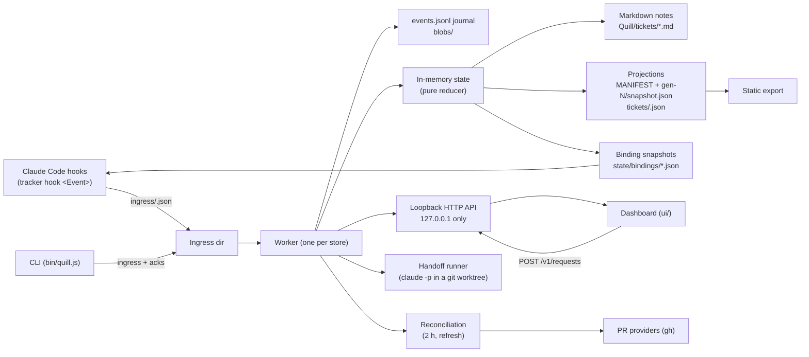

# Architecture guide for contributors

This is the code-level companion to the [TRD](TRD.md) and [data contract](DATA-CONTRACT.md). Those documents say what the system must do; this one says where it happens and which invariants hold it together.

## One picture

Everything flows through the journal. Hooks and the CLI only ever *write events*; the worker is the only process that mutates state, notes and projections; the UI only reads projections and *submits requests* that the worker turns into events.

## Directory map

| Path | Responsibility | Key entry points |
| --- | --- | --- |
| `src/hooks/adapter.js` | Turns host hook JSON into events and gate decisions. No network, no journal reads; reads only the binding snapshot, heartbeat and identity files. | `runHook(eventName, input, {env, now})` |
| `src/hooks/payload.js` | Extracts only contract-allowed fields (write paths, commit/PR metadata, plan text, checkpoint previews). | `writePathsFor`, `extractConclusions` |
| `src/gate/shell-grammar.js`, `src/gate/decide.js` | The read-only shell grammar and the tool decision matrix. | `classifyShell`, `decideGate` |
| `src/core/events.js`, `ingress.js`, `journal.js`, `blobs.js` | Event envelope and validation; durable ingress write (temp, fsync, rename); append-only journal with sequence numbers and tail quarantine; content-addressed blob store. | `makeEvent`, `writeIngress`, `Journal` |
| `src/core/state.js`, `reducer.js`, `transitions.js`, `keys.js`, `approval.js` | The pure reducer: `applyEvent(state, event)` and its helpers. Deterministic ids, idempotent on `event_id` and `source_identity`. | `applyEvent`, `deriveStatusFromEvidence` |
| `src/worker/worker.js` | The single writer: lock, replay, ingestion loop, note flush timer, projection publishing, heartbeat, control markers, acks, extension hooks. | `Worker`, `worker.use(extension)` |
| `src/worker/notes.js`, `markdown.js` | Note rendering with hash-guarded generated blocks; CRLF-tolerant parsing; conflict detection. | `renderTicketNote`, `parseNote`, `writeNote` |
| `src/worker/projections.js` | Snapshot and per-ticket detail projections; `MANIFEST.json` committed last. | `publishGeneration`, `buildSnapshot` |
| `src/reconcile/*` | Lifecycle (live/idle/extinct, stale), pick-next ranking, provider polling, the two-hour scheduler and refresh requests. | `runReconciliation`, `rankPickNext`, `createExtension` |
| `src/server/*` | Loopback API, bootstrap auth and CSRF, request validation and the request state machine. | `createServer`, `submitRequest`, `applyDueRequests` |
| `src/handoff/*` | Reservation rules, worktrees, agent spawn/kill, result recording, permission validation. | `createExtension`, `validateHandoffRequest` |
| `src/deploy/environments.js`, `src/today/*` | Effective environments, per-environment status, the Today feed and the daily digest writer (ADR 0009). | `effectiveEnvironments`, `environmentStatus`, `buildToday`, `writeDigest` |
| `src/agents/*` | Recipe frontmatter parsing, discovery and precedence (repo, personal, built-in in `recipes/`), prompt rendering, and suggestions from typed outputs (ADR 0008). | `createRecipeCatalog`, `catalogFor`, `buildSuggestions`, `suggestionMutation` |
| `src/export/*` | Sanitization and the single-file static build. | `sanitizeSnapshot`, `buildStaticHtml` |
| `src/migrate/*` | Inventory, PMLA mapping, backup, run and rollback. | `runMigration`, `rollback` |
| `src/cli/*` | Argument parsing, context loading, commands. Commands that change state wait for a worker ack file. | `main`, `submitAndWait` |
| `ui/` | Dashboard as plain ES modules with pure render functions (`renderBoard(snapshot, filters, opts)` returns HTML) and one imperative shell (`app.js`). | `startApp` |

## Lifecycle of a tool call

1. Claude Code runs `node bin/quill.js hook PreToolUse` with JSON on stdin.
2. The adapter reads `state/identity.json` (store id, machine id, config flags), `state/heartbeat.json` (worker health, 15 s window) and `state/bindings/<session>.json`.
3. `decideGate` returns `deny` or `none`. `none` means "no opinion": the host's own permission flow applies. The gate never emits `allow`.
4. A `pre-tool` event with the attribution snapshot (ticket, binding revision, tool call id) is written to ingress. On write failure the hook denies covered tools and reports a capture gap.
5. After the tool runs, `PostToolUse` writes a `post-tool` event. The reducer attributes it to the pre-call record, never to the current binding; an early result waits for its record; an unmatched one surfaces as unresolved after the next reconciliation.
6. The worker ingests both within its 500 ms tick, journals, applies, republishes the binding snapshot immediately and the notes within 30 s.

## Invariants to preserve

- **Durability before acknowledgement.** `writeIngress` fsyncs and renames; `Journal.append` fsyncs; CLI acks are written only after the journal transaction.
- **One effect per event.** The reducer short-circuits on duplicate `event_id` or `source_identity`; worker-produced events carry explicit `source_identity` values such as `request-tx:<id>:applied`.
- **Deterministic replay.** Every generated id comes from `deterministicId(seed)`. Replaying the journal must rebuild byte-identical state; `tests/worker/worker.test.js` checks this after a simulated crash.
- **Reducer exceptions are contained.** `Worker.safeApply` marks a throwing event as applied, records an `apply-error` health entry and continues. Never let a bad payload stop replay.
- **Complete generations only.** Projections are written to `gen-N/` first and `MANIFEST.json` last; the UI reads the manifest. Detail endpoints refuse a stale `generation` parameter with 410.
- **Authored text is never absorbed or destroyed.** `writeNote` compares generated-block hashes and the frontmatter hash recorded in `state/notes-index.json`; any mismatch, CRLF conversion or unrecognized layout is a conflict that keeps the file.
- **Revision checks, never last-write-wins.** Requests carry `expected_revision`; a mismatch is a `conflict` with the current value attached.
- **Permissions are explicit objects.** Handoff permissions come from the request, are validated at submission and again at dispatch, and never from approval text or notes.

## Extension model

The worker exposes `use({ onStart(worker), tick(worker), onStop(worker, opts) })`. Three extensions ship:

- `src/reconcile/extension.js` runs reconciliation on schedule and for `refresh` requests.
- `src/server/extension.js` hosts the API and applies due requests.
- `src/handoff/extension.js` dispatches queued handoffs, enforces deadlines and cancellation, and resolves interrupted runs on start.

Extensions run inside the worker's single-threaded tick and emit events through `worker.emit(kind, payload, extra)`, which journals and applies synchronously.

## Where the spec lives

- Field names, enums and transitions: [DATA-CONTRACT.md](DATA-CONTRACT.md)
- Mechanics (gate matrix, durability, reconciliation, transport, handoff, migration): [TRD.md](TRD.md)
- Scope and guarantees: [PRD.md](PRD.md); screens and interactions: [UI-DESIGN.md](UI-DESIGN.md)
- Decisions with their trade-offs: [decisions/](decisions/)
- Scenario checklist and current evidence: [ACCEPTANCE.md](ACCEPTANCE.md), [ACCEPTANCE-RESULTS.md](ACCEPTANCE-RESULTS.md)
