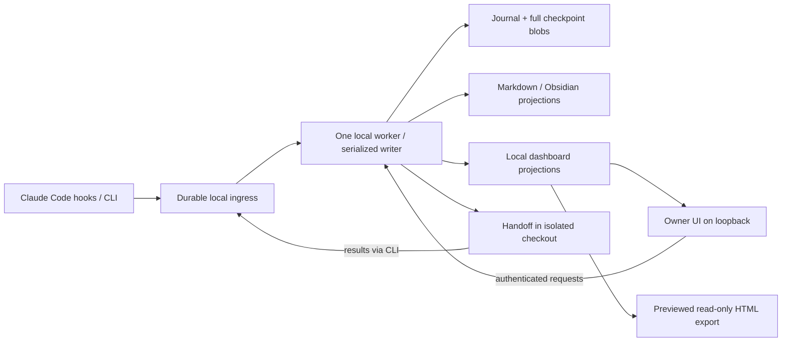

# Session Quill — Technical Requirements & Design (TRD)

Status: revised draft v0.2 · 2026-10-02 · Owner: Shivam
Companions: [PRD](PRD.md), [data contract](DATA-CONTRACT.md), [UI](UI-DESIGN.md), [acceptance](ACCEPTANCE.md), [decisions](decisions/).

This is an implementable design contract, not a claim that integrations have already been built or tested. The committed documents are authoritative for v0.2. Earlier live documents and PNG diagrams are historical v0.1 references and must not override this design.

## Architecture



The local worker owns scheduling, projection updates and request processing. Deterministic reconciliation never requires a model. Handoff reasoning is an optional model-backed operation. Hosted artifact databases, remote device bridges and hosted task APIs are not v1 dependencies.

One logical store has one owner machine and one worker. Machine identity is a persisted UUID, not a hostname. Copying or syncing a store never authorizes a second writer. Moving ownership requires stopping the first worker and explicitly importing/transferring the full journal, blobs and store metadata; concurrent multi-machine merge is unsupported.

## Durability and concurrency

1. Each hook or CLI producer assigns an event UUID. It writes an exclusive temporary file under `~/.claude/quill/ingress/`, flushes it and atomically renames it to `<event_id>.json`. Only complete files are eligible for ingestion. Referenced checkpoint blobs must be persisted before the event. A successful receipt means this persistence completed, not that notes already changed.
2. The worker holds an exclusive per-store local socket/named-pipe ownership lock released by the OS on exit. The endpoint is derived from owner and store UUIDs; startup verifies the canonical store path. Never steal ownership on a timer. A competing worker refuses to start.
3. The worker serially validates ingress, assigns a monotonically increasing sequence, appends to `events.jsonl`, flushes the journal and only then acknowledges ingestion. Duplicate event IDs or source identities have one effect. A restarted worker scans its checkpoint plus the journal tail before applying new events.
4. Ticket, session, request and binding projections are written to temporary files in their destination directory and atomically replaced. Windows replacement retries do not fall back to truncating the destination. A commit manifest identifies a completed projection generation; the UI only reads complete generations.
5. Dirty notes flush no later than 30 s after the first unmaterialized event. Later events cannot postpone that deadline. Stop, SessionEnd and explicit sync request an early flush. The persistent worker timer handles the case where no more hooks arrive.
6. Ingress is retained until its journal entry is flushed. A crash between journal append and ingress cleanup therefore causes harmless redelivery. A torn journal tail is quarantined and recovered from remaining ingress; corruption in the middle stops replay and reports recovery required.
7. Bind/create/relink commands wait for a worker-confirmed revision; an offline command must not pretend binding changed. Non-gate capture can still persist ingress while the worker is unavailable. Gate writes require a healthy worker and readable committed binding.
8. Hook p95 budget is 200 ms; persistence timeout is 1 s. On capture failure, emit a non-blocking diagnostic and record a health error when storage becomes available. Do not return success receipts for failed persistence. Gate error responses deny covered operations, but host timeout/crash behavior is outside the gate guarantee.

The worker updates its local health heartbeat every 5 s; a heartbeat older than 15 s is unavailable for gate decisions. Binding snapshots are published immediately after their journal transaction, independently of the 30 s note timer. Ingress may arrive out of order: tool results wait for their matching pre-call attribution record; they are not assigned by ingestion order. Missing pre-call records remain unresolved and visible after one reconciliation run. Wall-clock timestamps describe observations; journal sequence and binding revisions determine update order.

Use local filesystems for ingress/journal. Test flush/rename behavior on each supported platform. Durability covers tested process-crash recovery; power loss, disk loss and third-party sync corruption require backups and are not absolute guarantees.

Replay reduces events into generated state; it never runs tools, resends remote requests, pushes branches or restarts handoffs. Duplicate successful tool events do not increment counts twice. Full replay writes a staging store, validates it, then switches generations. Default replay keeps the original store and offers a comparison.

User-authored text lives outside marked generated blocks. Preserve it byte-for-byte on ordinary updates. Compare generated-block hashes before replacement; external changes create a conflict and keep the original file. A user can explicitly import supported field changes through the CLI, creating journal events, or restore the generated block after preview. Never silently absorb manual generated edits. A full backup is required to reconstruct authored text on an empty disk; the journal alone rebuilds only generated content.

## Canonical schema

[DATA-CONTRACT.md](DATA-CONTRACT.md) is authoritative for fields, enums, identities and transitions. Both markdown and dashboard JSON derive from it; the UI must not invent extra fields.

Store layout:

```text
Quill/
  store.json
  tickets/<safe-key>.md
  sessions/<session-id>.md
  handoffs/<handoff-id>.md
  authored/                 # preserved user attachments, if any
~/.claude/quill/
  config.toml
  ingress/
  events.jsonl
  blobs/<content-hash>
  state/                    # binding snapshots, request state, indexes
  projections/
```

Ticket body order: user Summary; generated Timeline, Approved plans, Conclusions, Files touched, PRs and deployments, Follow-ups, Handoff notes; user Notes. Generated links use stable internal IDs, rendering current ticket keys. Validate path components and canonical destination containment; neither keys nor imported links may escape the store.

Use UTC RFC 3339 timestamps with explicit offsets normalized to `Z`; dates such as due dates use YYYY-MM-DD and the store's configured IANA time zone. Schema version is independent of plugin version.

## Ticket gate

The gate applies only to tool calls delivered to its supported hooks. It is not a security sandbox or a guarantee about arbitrary filesystem changes.

Gate modes ([ADR 0005](decisions/0005-gate-modes-and-auto-binding.md)): `strict` enforces the matrix below; `nudge` (default) never denies a tool call and instead asks once at `Stop`, per session, when an unbound session changed files or committed; `off` captures only. Legacy `gate_enabled = false` means `off`. A repository `.quill.toml` may tighten the user's mode but never loosen it; unrecognized values and identities written without a mode are `strict`. The rest of this section describes `strict` mode.

| Operation while unbound | Decision |
| --- | --- |
| Dedicated Read, Glob and Grep | Pass through to normal host permissions |
| Supported Edit, Write, MultiEdit and NotebookEdit | Deny, except the verified host plan-file exception |
| Bash or native PowerShell | Permit only the tested read-only grammar below; otherwise deny |
| Registered mutating MCP/other tools | Deny |
| Unregistered tools with unknown effects | Deny until bound, except explicitly registered non-mutating host control tools |
| Quill bind/create/show/off commands | Permit only validated direct CLI invocation targeting quill state |
| Host plan controls and approved plan-file exception | Permit; capture approval only on verified successful approval outcome |

The initial shell read subset is deliberately small: exact `pwd`, `git status` (`--short`, `--branch`, `--porcelain` only), literal-path `ls`/`cat` on Bash, and literal-path `Get-Location`/`Get-ChildItem`/`Get-Content` on PowerShell with an explicitly tested option grammar. Deny pipelines, redirects, command substitution, statement separators, script execution, environment assignments, unknown options and shell profiles that can run arbitrary setup. Start shell tools without user startup profiles where the host supports it; document that ambient command wrappers/aliases remain outside the guarantee. Dedicated read/search tools remain available when a shell form is rejected. Add read forms only with fixtures, never a write-command blacklist.

An active binding permits these operations to proceed through normal host permissions; do not emit an unconditional host permission `allow` override. Gate-off is scoped to the session or explicit user configuration, emits an audit event, remains visible and ends on explicit re-enable. Provide both `/ticket off` and `/ticket on`.

The plan-file exemption permits only the exact canonical host-designated plan path for that session, under the verified plan directory, excluding symlink/reparse escapes. Host plan mode alone never exempts source edits. Phase 0 must prove reliable plan-path identification; if unavailable, that host version is unsupported for the full gate/read/plan contract, rather than silently widening the exception.

Quill initialization is a terminal/setup operation. Direct quill state-changing commands are narrowly exempt so a user can bind before source writes; arbitrary shell wrappers around them are not exempt. This gate remains a user-controlled workflow aid: disabling it is possible and logged when observable.

## Binding and attribution

- Identity is store ID + machine ID + host session ID, with optional agent ID and explicit parent mapping from verified lifecycle events. Never resolve a binding by cwd.
- Each binding change increments a binding revision and closes the previous history interval. Rebind affects future calls only.
- Before a tool runs, capture its tool-call ID and current ticket/binding revision. PostToolUse refers to that saved attribution, even if the session was rebound while it ran. If the call ID or parent mapping is missing, quarantine attribution as unresolved; never guess another session's ticket.
- Zero-command binding (ADR 0005): with a `[tracker]` table configured, a key matching `key_pattern` and the prefix allowlist in a prompt (`UserPromptSubmit`) or in the branch read from `.git/HEAD` (`SessionStart`, unbound sessions only) binds the session. The hook writes a provisional binding snapshot before persisting the `bind` event; the worker keeps a fresh provisional snapshot until that event is applied, then publishes the confirmed binding. The reducer binds to the ticket whose key or alias matches, or creates it under that key with a deterministic id. Patterns are validated at config load and scans are bounded (4,000 characters, 10 keys). Bindings remain forward-only.
- A subagent inherits the parent's binding at launch. Its ongoing calls retain that binding unless explicitly rebound; a later parent rebind is not retroactive.
- Resume restores identity and history. Project changes require explicit rebinding/confirmation through the CLI; do not retag older events when cwd changes.
- Session records contain all bindings and ticket IDs. Ticket session lists derive from attributed events/bindings, including active sessions before SessionEnd.
- Local keys are `<prefix>-<slug>-<short-id>`, default prefix LOCAL; child keys use a serialized parent counter. Stable ticket UUIDs never change. Relinking changes the displayed key and adds an alias atomically; reject an existing key/alias collision.
- Jira bind validates syntax locally. With a configured provider, successful remote validation sets valid; network/auth outage sets pending with a reason and allows local binding. A definitive missing key sets invalid; preserve the local ticket and require correction of the external link, not deletion of its audit history.

## Capture and approval

| Event | Persisted behavior |
| --- | --- |
| SessionStart | Create/resume identity; inject current binding/help; resume does not reset history |
| UserPromptSubmit | First prompt produces a sanitized 80-character title; subsequent prompts are inspected only for enabled approval matching and not retained wholesale |
| PreToolUse | Gate decision and attribution snapshot; an allowed attempt is not counted as a successful write |
| PostToolUse | Capture successful supported file writes; commit/PR metadata from tested adapters; actual approved-plan content on verified ExitPlanMode success |
| PostToolUseFailure | Record failure and possible partial changes as unknown; do not claim no files changed |
| Stop | Persist full assistant checkpoint as a blob; derive 1,500-character preview and marker-based conclusions referencing the full text |
| PreCompact | Save recovery summary from already captured events/checkpoints; this is not a claim to capture the host's eventual compaction summary |
| SubagentStart / SubagentStop | Record explicit parent/agent identities and full final checkpoint when available |
| SessionEnd | Mark ended and flush; abrupt termination without this event is recovered by time-based lifecycle rules |

Shell/MCP write counts include only changes verified by the relevant adapter. Other permitted bound calls are recorded as tool activity with change coverage unknown. Do not fabricate file paths or classify every successful shell command as a write. PR and commit provider failures remain visible.

Explicit approval selects the latest checkpoint for the current binding, or an explicit checkpoint ID belonging to that ticket. No checkpoint is a useful error. Approval uses a unique checkpoint/ticket key, so repeated approval has one effect.

Optional heuristic defaults off. When enabled, match the complete trimmed case-insensitive next user prompt against the phrase list (approved, lgtm, go ahead, ship it), within 10 min of the checkpoint, on the same binding with no intervening tool activity or prompt. Quoted text, added sentences and negation do not match. Record heuristic provenance; never infer tool/deployment permission from it.

The durable store keeps complete checkpoint blobs; oversized transport fields are streamed/chunked, not silently truncated. Missing content becomes a capture error and an incomplete checkpoint, not an approved full analysis.

## Reconciliation and lifecycle

The worker reconciles every two hours, all days, with immediate catch-up after startup/wake. Manual Refresh queues an immediate run independent of that schedule.

Schedules ([ADR 0007](decisions/0007-schedules-and-bitbucket.md)): reconciliation runs as the `reconcile` job of a scheduler that reads `[[schedule]]` tables from user config (`name`, `job`, and one of `cron` in the store's IANA time zone or `every`, optional `enabled`). With none, `reconcile` runs every `sync_interval_hours`. Each job runs at most once at a time; missed slots collapse into one catch-up run; every run is journaled as `schedule-run` events and a run left unfinished is marked interrupted on restart, reruns once as a catch-up, and fails the requests that joined it with code `interrupted` (retryable). `run-job` requests start a named schedule immediately with no undo delay. Jobs named by the roadmap but not built yet are accepted with a warning and not run. Deterministic work includes link repair, lifecycle, staleness and ranking. Optional category suggestions require explicit acceptance; default category is research when neither repo nor command supplies one.

Each run:
1. Import pending captured events and validated manual imports.
2. Reconcile all open ticket/session identities, even if their files have not changed; incremental parsing is only a content optimization.
3. Poll configured PR providers for nonterminal PRs, including records with unchanged note mtimes. Retain last known evidence and a provider error on failure.
4. Recompute time-derived state and ranking, validate the graph, publish one complete dashboard generation.
5. Set last_sync only after successful publication. A failed provider may produce a usable local generation with an explicit provider error; never mark remote evidence fresh.

Session state: ended on SessionEnd; otherwise live while a captured event is <= 30 min old, idle after 30 min and before 48 h, extinct at >= 48 h. A new event/resume returns idle/extinct to live. Live is an activity indicator, not a process liveness guarantee and never a source-edit lock. Compaction does not end a session.

Ticket stale is a derived flag: status active and last substantive activity >= 5 days old. Reconciliation, polling and derived-state writes do not reset activity. New work clears the flag without losing status; blocked/done tickets do not acquire it. A journaled notification for an extinct unpromoted checkpoint is emitted once per checkpoint, not on every sync.

## Workflow and deployments

The data contract defines status transitions and manual override precedence. PR evidence can propose/derive review and deploy-pending, but must not overwrite a blocked state or an explicit manual status at the same evidence version. Repeated polls do not undo a user's choice.

Deployments track individual merged PRs and environments, not a single ticket boolean. Mark deployed requires selected PR IDs, environment, timestamp and evidence/note. A waived deployment requires a reason. A ticket can be done with outstanding deployments after explicit user confirmation; it remains listed in Deployments until each obligation is deployed or waived. Never equate a draft PR with a merged deployment obligation.

Environments and evidence ([ADR 0009](decisions/0009-environments-and-today.md)): a repository's `deployment_environments` win, then `[tracker].environments`, then production, and the reconcile event records the list each merge used so replay is stable. Recorded deployments carry an evidence kind (merge, tag bump, ArgoCD sync, release, manual, agent). The snapshot gives each ticket its per-environment status (pending, done, n-a, none). The worker also builds a seven-day Today feed in the store time zone, and a `digest` schedule writes one day of it into a marked section of the daily note or a file, never over an edited section.

## Pick-next

Eligible candidates are statuses todo, active, review and deploy-pending. Exclude blocked and done before scoring; blocked records form a separate list with blocker text.

| Signal | Raw points |
| --- | --- |
| Priority P0 / P1 / P2 / P3 | 40 / 25 / 10 / 0 |
| Due overdue or within 3 local calendar days / within 7 days | 30 / 15 (exclusive) |
| Oldest pending merged PR >= 2 days old / younger | 20 / 10 (exclusive) |
| Oldest open PR >= 1 day old, status review | 15 |
| Nonempty next_action | 10 |
| Parent has another direct child done | 10 |
| stale flag true | 10 |
| Untouched N >= 2 days, not stale | N (at most 9) |

Display score = min(100, raw score). Rank by raw score descending, then due ascending (null last), priority ascending, last_activity ascending and stable ticket ID. Reasons list actual contributing signals. Show at most five, and fewer when fewer eligible candidates exist. Provider-unknown dates earn no age points and show the evidence limitation.

## Local dashboard and request transport

`quill ui` opens a dashboard served by the worker on loopback only. It never binds to a LAN/public interface in v1. Initialization starts/supervises the worker via the OS service mechanism; CLI diagnostics expose ownership, backlog and errors. UI loss of connection leaves the last rendered generation visible with an offline banner and disables submissions.

The worker provides versioned JSON endpoints:
- `GET /v1/snapshot`: complete generation, collections and capabilities.
- `GET /v1/tickets/<id>?generation=<id>` and `GET /v1/content/<hash>?generation=<id>`: paged detail and full permitted content from that generation; return generation-expired so the client can reload rather than mixing revisions.
- `GET /v1/requests/<id>`: acknowledgement and outcome.
- `POST /v1/requests`: authenticated mutation, returning 202 only after persistence.
- `POST /v1/requests/<id>/cancel`: durable cancellation with explicit race outcome.

Bind to loopback; validate Host and Origin, reject cross-origin requests, and require an owner session plus CSRF protection for mutation. Bootstrap through a one-use CLI-generated secret exchanged for an HttpOnly SameSite cookie; remove the secret from the URL immediately. Do not place reusable tokens in export, history, logs or browser storage. Phase 0 proves this round trip and rejects unauthenticated/cross-origin calls.

UI polls every 2 s while visible, backs off while hidden and reconnects after wake. Requests and handoff progress publish independently of two-hour reconciliation. A Refresh run begins within 5 s on an available idle worker; an existing run is reused with its ID. Long work is off the serialization lane so hooks and requests remain responsive. Offline UI actions are not claimed queued; only acknowledged persisted requests are queued.

Request state/validation is defined in DATA-CONTRACT. Ticket edits have a 10 s not-before window for undo. Cancellation is serialized against application; success means cancelled, while already applied means show applied and offer a new revision-checked reversal. Handoff and Refresh do not have the edit undo delay.

`quill ui --static` creates standalone read-only HTML without service dependencies. `quill export` additionally requires project/field selection and an exact preview; checkpoint bodies, paths and private links are excluded by default. Export never sends messages or uploads automatically. Exported files show generated_at, last_sync and snapshot limitations, and contain no request code, owner token or local store URI.

Hosted adapters are phase 6. They must prove per-user storage isolation, authenticated owner requests, enforced viewer-only access, revocation, request deduplication, delivery acknowledgement, offline behavior and an actual worker wake-up mechanism before live sharing is offered.

## Handoff execution

Modes use wire values analyse, analyse-followups, attempt-fix. Default is analyse-followups with no source access. Permissions are a per-request object, never inferred from approval text:
- read_source: optional for analysis; required for attempt-fix.
- edit_source: required for attempt-fix and limited to an isolated checkout.
- commit: separate opt-in, off by default.
- push_branch: separate opt-in, requires commit and an explicit non-default destination branch.
- open_draft_pr: separate opt-in, requires push_branch and configured provider credentials.

Never push a default/protected branch, merge or deploy. Without push/PR permission, attempt-fix delivers local diff/tests and optionally a local commit; it does not promise a PR. A source-requesting handoff requires the registered repo and owner machine. If source is unavailable, fail with a reason rather than silently changing scope; a new note-only analysis request is available.

The worker atomically reserves one queued/running handoff per ticket; duplicate request IDs return the existing run. Fix runs for the same repo are serialized in v1. A clean isolated Git worktree is created from the recorded base commit; it never incorporates another live session's dirty changes or writes its checkout. If worktree creation fails, fail the request. Analysis treats imported notes/source as data, not instructions to expand permissions. All agent file and command access is confined to the allowed checkout and quill result API.

Execution time starts on entering running; wall-clock timeout is 20 min and includes sleep. Cancellation/timeout stops the agent and its subprocess group, preserves patches/logs/results and reports cancelled/timed-out. Unknown remote effects are recorded as uncertain and reconciled before any retry. Retain recovery checkout paths; cleanup is explicit after results are accepted.

An interrupted running request becomes failed with interrupted reason on restart. Never automatically retry a fix or remote side effect. An explicit retry creates a new run referencing the previous run; it reconciles prior branch/PR/child IDs first. Child creation uses a stable run/result-item identity and cannot duplicate on result redelivery.

Recipes ([ADR 0008](decisions/0008-agent-recipes.md)): the three modes are now built-in recipe files beside `deploy-check` and `standup`; teams and owners add recipes in `.quill/agents/` (repository, highest precedence) or `~/.claude/quill/agents/`. A recipe's frontmatter permissions are a ceiling for each run, its `tools` can only narrow the permission profile, and its `timeout_min` (at most 20) caps the run. The request records the recipe hash, re-checked when the request applies and again at dispatch. Outputs of recipes other than the built-in modes become suggestions accepted through revision-checked requests; a comment draft is never posted. An `agent` schedule queues read-only runs over a ticket scope and refuses `attempt-fix` recipes.

Only analyse-followups creates children by default. Suggested next_action updates use the parent's recorded revision and become conflicts if it changed. A blocker is a suggestion; the agent cannot silently overwrite a newer owner status. A draft PR creates no deploy-pending child. Deployment obligations appear only when merge evidence arrives.

## Publishing

Publishers ([ADR 0010](decisions/0010-publishers.md)) are `[[publish]]` entries in user config: `markdown` (a roll-up table per status in a marked section of a note), `html` (the standalone export written to a path) and `artifact` (a live claude.ai page). Content always goes through the export sanitizer with the publisher's fields and projects. Nothing is sent to a destination until the owner confirms it; a changed path or URL is a new destination. The artifact page renders rows from its own db; publishes after the first read each row with its version and write only fields nobody else changed, pinned to that version. Quill computes every write; a Claude Code session (`/session-quill:publish`, the default) or a headless runtime with the Artifact tools executes the plan. Publishes run on demand, after reconciliation (`on = ["reconcile"]`) or as a `publish` schedule job.

## Configuration and packaging

Ship plugin manifest, hook config, namespaced commands, CLI, local worker, UI assets, templates, optional handoff agent and PMLA profile. Core uses Node built-ins; validate the restricted TOML/YAML subsets written by quill, preserve unknown authored text, and reject unsupported syntax rather than lossy parsing.

`quill init` collects store path and project defaults, writes user config and a per-repo .quill.toml, checks prerequisites, registers the worker and verifies a round trip. Re-running is idempotent and preserves existing hook/status-line setup. Git clones need a documented plugin load/install command; cloning alone is not installation.

Configuration precedence: explicit CLI option, session override, repo defaults, user defaults. Store ownership and handoff permissions cannot be weakened by repository config. Secrets remain in the user's credential store or environment, never committed repo config.

Resolved defaults:
- Working name session-quill; final public license and repository owner are release inputs.
- Single owner machine; plain markdown default, optional Obsidian path.
- LOCAL prefix; project from init; category research unless configured.
- Gate mode nudge (strict and off available, ADR 0005); auto-binding only with a configured `[tracker]`; approval phrases off.
- Stale active tickets after 5 days; live <= 30 min; extinct >= 48 h.
- Reconcile every 2 h, all days, local IANA time zone; catch up once on wake. Custom cadences and extra jobs come from `[[schedule]]` in user config (ADR 0007).
- PR providers: GitHub through `gh`; Bitbucket Cloud or Server/Data Center over REST (`provider = "bitbucket"`, `provider_url` for Server, `token_env`/`username_env` naming environment variables). Tokens are sent only to the configured host.
- Handoff analyse-followups, source off; commit/push/PR permissions off.
- Optional PMLA profile contains Bitbucket polling and configured private skills; no private paths or credentials ship publicly.
- A provider missing at runtime shows unknown evidence rather than fabricated PR/deployment state.

Pin tested Node and Claude Code version ranges during phase 0; refuse unsupported configurations with a diagnostic. Do not claim Node is bundled with Claude Code. Native Windows and WSL use distinct machine/store ownership unless explicitly transferred.

## Migration and rollout

`quill migrate --dry-run` inventories source notes, maps identities/statuses and lists ambiguous records without writing. Migration requires a full backup of notes, hooks/settings, journal and blobs. Import every generated source value as migration events and preserve authored sections and original paths in the manifest.

PMLA mapping: open maps to active only with explicit in-progress evidence, otherwise todo; PR raised to review; merged to deploy-pending; deployed to done. Legacy stale maps to active plus derived stale unless prior status evidence exists. Legacy deploy skipped becomes a waiver with imported provenance and a reason; missing reason requires review. Preserve all existing files until verification succeeds.

Pause old hooks/agents before enabling the new writer; snapshot settings and switch atomically to avoid double capture. Verify ticket counts, links, checkpoints and deployment obligations. Rollback restores original settings and untouched source notes; newer quill events are preserved/exported for reconciliation, not discarded.

Keep the old PMLA dashboard read-only until at least one week of verified operation, then retire only through an explicit operator action. Follow the [PRD phase gates](PRD.md#release-plan) and [acceptance scenarios](ACCEPTANCE.md); no one-session implementation estimate is asserted.
