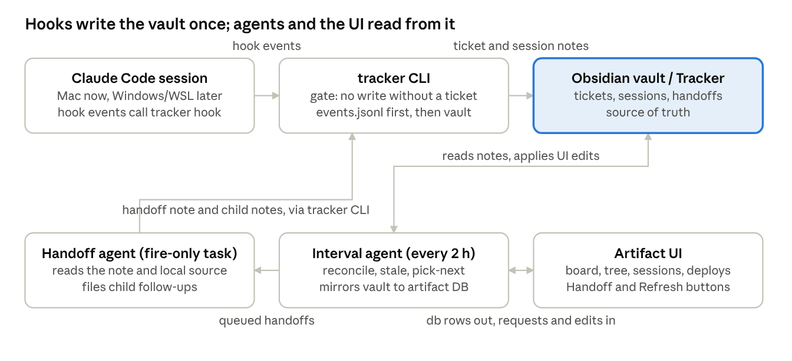
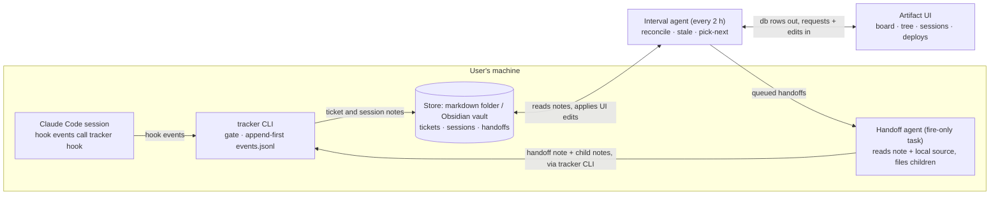
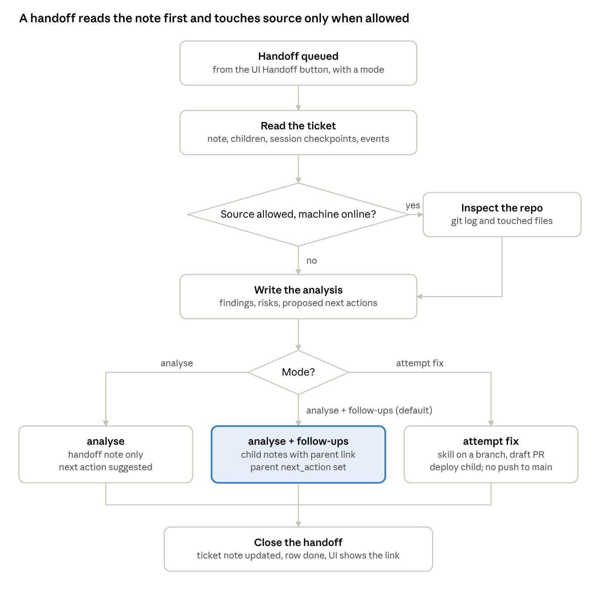
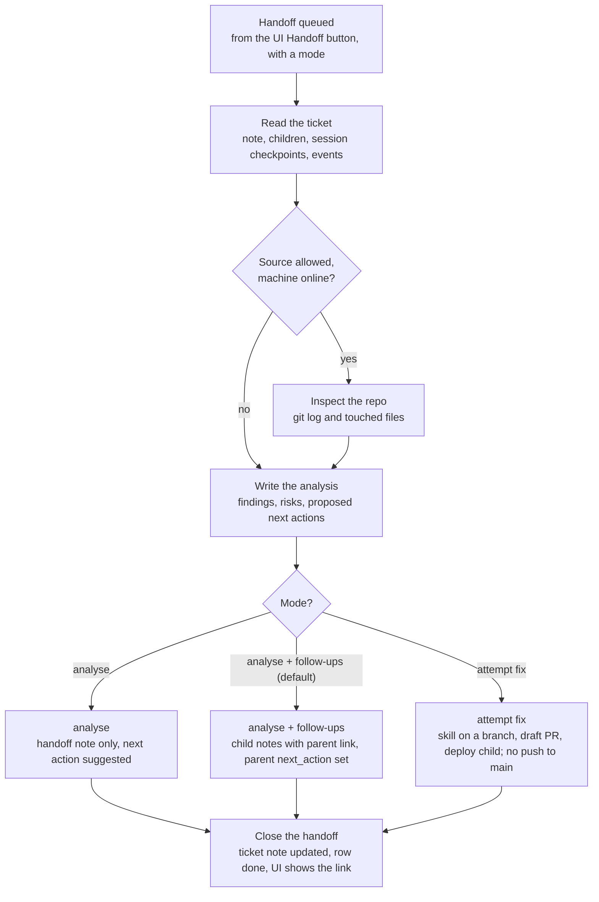
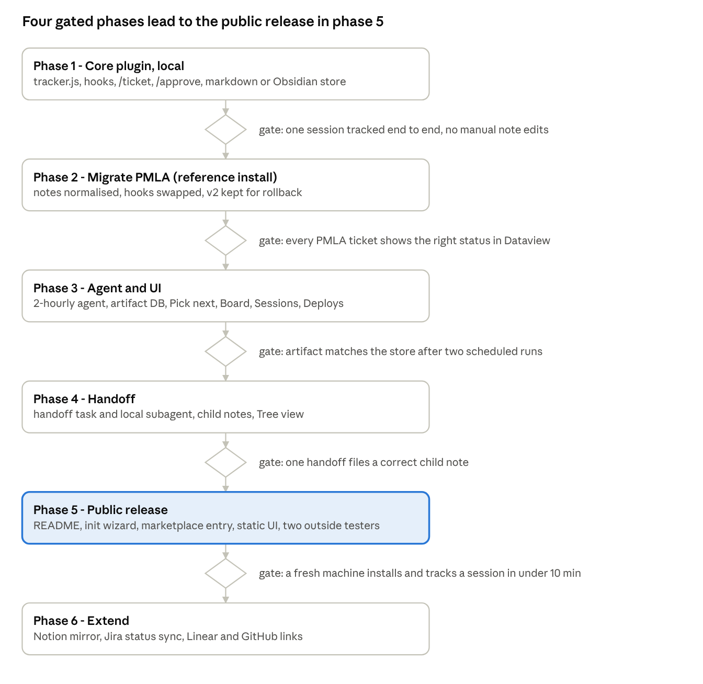
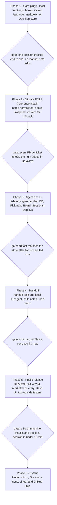

# Session Tracker — Technical Requirements & Design (TRD)

Status: draft v0.1 · 2026-10-02 · Owner: Shivam
Live doc (editable, with comments): https://claude.ai/code/artifact/e7c5396d-215e-40fd-8e8a-37cb7f1ee220
Companion docs: [PRD](PRD.md) · [UI design spec](UI-DESIGN.md) · [Decisions](decisions/)

## Problem and goals

The tracker is a public tool: anyone using Claude Code gets their own session tracker that ties every session to a real project and ticket, so no session's work is lost when they switch away. It starts from the PMLA stack (hooks → Obsidian → agent → artifact) and generalises it: pluggable backends, any project, installable as a plugin.

What v1 must guarantee:

- No write without a ticket. Edit, Write or commit in a session with no bound work item is refused until one is bound. A local note (markdown folder or Obsidian vault) is the mandatory entry; Jira or Notion are optional links.
- Every write, approved plan and conclusion lands in the store within seconds, on the right note, with project, category, tags and a parent link.
- A session that goes extinct (closed, compacted, forgotten) still has its last state, conclusions and next action readable in the store and in the UI.
- The UI answers two questions at a glance: what is the status of each item, and what should I pick next.
- Any item can be handed to an agent that reads its note, looks at local source when needed, and files child follow-ups.
- Installable by anyone: one plugin install and one `tracker init`; hooks and notes work offline on the user's machine with no cloud dependency.
- Project tagging is automatic: `tracker init` in a repo records the project, so every ticket and session carries the real project name without manual tagging.

Out of scope for v1: Jira or Notion as system of record, shared team dashboards (one tracker per user), hosted sync between users.

## Architecture





Sessions never touch the vault directly: the tracker CLI is the single writer, the interval agent mirrors the vault into the artifact database, and the handoff agent files its results back through the same CLI. This is the PMLA v2 flow (hooks → vault → agent → artifact) with the gate, the handoff loop and the shared database added.

## Vault schema

One folder `Tracker/` in the vault, four note types, all linked through frontmatter so Dataview or Bases can build any view without parsing bodies.

| Note type | Path | One per | Key frontmatter |
| --- | --- | --- | --- |
| Ticket | `Tracker/tickets/<KEY>.md` | work item (feature, bug, vuln, infra, research) | key, title, status, category, priority, parent, children, jira, repo, prs, sessions, next_action, last_activity |
| Session | `Tracker/sessions/<session_id>.md` | Claude Code session | session_id, ticket, machine, cwd, started, ended, state (live / ended / extinct), writes, last_checkpoint |
| Follow-up | `Tracker/tickets/<KEY>-f<n>.md` | child task, filed by you or the handoff agent | ticket fields + parent `[[KEY]]`, origin (handoff / manual) |
| Handoff | `Tracker/handoffs/<KEY>-<ts>.md` | one handoff run | ticket, requested_at, mode, result, children_created |

Ticket frontmatter, as hooks write it:

```yaml
type: ticket
key: DIQ-412
title: KRaft migration - JDK21 broker rollout
status: active        # todo | active | blocked | review | deploy-pending | done | stale
category: infra       # feature | bugfix | vuln | infra | research | analysis
priority: P2
parent: "[[DIQ-400]]"
children: ["[[DIQ-412-f1]]"]
jira: DIQ-412
repo: data-iq/kafka-platform
prs: ["https://bitbucket.org/paytmmoney/kafka-platform/pull-requests/88"]
sessions: [a1b2c3, d4e5f6]
next_action: "Verify controller quorum on stage after the JDK21 image"
last_activity: 2026-10-02T14:03
tags: [tracker/status/active, tracker/cat/infra, kafka]
```

Ticket body keeps a fixed heading order so hooks append under the right one: Summary, Timeline (dated log, newest first), Approved plans, Conclusions, Files touched, PRs and deployments, Follow-ups, Handoff notes.

Rules:

- `status` and `category` are closed sets; hooks and the agent write only those values. `stale` is set by the agent, never by a hook.
- Parent/child is `parent:` on the child plus `children:` on the parent; the agent reconciles both sides every run.
- Tags mirror status and category (`tracker/status/*`, `tracker/cat/*`) so graph view and tag search work without plugins.
- Key is the Jira key when one exists, else `LOCAL-<slug>`; `/ticket relink` moves a LOCAL key to a Jira key later and leaves an alias.
- Session notes are the audit log, ticket notes the curated view. Hooks write both; the agent edits ticket notes only.

## Ticket gate

A `PreToolUse` hook denies every write in a session that has no bound ticket, and tells Claude exactly how to bind one. Reads, searches and plan mode are never gated, so a research-only session costs nothing.

What counts as a write:

- Tools `Edit`, `Write`, `MultiEdit`, `NotebookEdit` (matcher on tool name).
- `Bash` commands matching `git commit|git push|git merge|git rebase|mv |rm |sed -i|> ` and package publish commands; everything else in Bash passes.
- Subagent tool calls fire the same hooks; whether they carry the parent session id is checked in phase 1, with a cwd-based lookup of the binding as the fallback, so the rule still covers `Agent` fan-out.

Binding model:

- Binding lives in `~/.claude/tracker/sessions/<session_id>.json`: `{ticket, bound_at, cwd, machine}`. One ticket per session; rebinding is allowed and logged.
- `/ticket DIQ-412` binds an existing note. `/ticket new "<title>" --cat infra --parent DIQ-400` creates the note from the template, then binds. `/ticket` alone prints the current binding.
- The slash command is a Claude Code command (`commands/ticket.md` in the plugin) that runs `tracker bind …`; the gate's deny message says the same thing, so Claude recovers on its own after one refused write.
- On `SessionStart`, the hook injects the binding (or the instruction to bind) into context, so a resumed session knows its ticket without being asked.
- Status line shows `[DIQ-412 · active]` or `[no ticket]`, read from the same binding file.

Gate decision, per tool call:

1. Read `session_id`, `tool_name`, `tool_input` from the hook's stdin JSON.
2. Not a write → exit 0, allow.
3. Binding file exists and its note exists in the vault → allow; record the write (see capture hooks).
4. Otherwise → return `permissionDecision: deny` with reason `No ticket bound. Run /ticket <KEY> or /ticket new "<title>" before writing.` and append an `unticketed_write_blocked` event to the session log.

Escape hatch: `TRACKER_GATE=off` in the environment (or `/ticket off` for the session) disables the gate but still logs; the UI shows those sessions as unticketed so they can be tagged later.

## Capture hooks

Every Claude Code hook event routes to one CLI, `tracker hook`, which appends an event to a local log and then updates the bound ticket's note. The gate is the only hook that can block; every other hook exits 0 even when the vault write fails, so tracking never stalls a session.

| Hook event | Matcher / trigger | What lands in the vault |
| --- | --- | --- |
| SessionStart | all | Session note created (machine, cwd, started); binding or bind instruction injected into context |
| UserPromptSubmit | first prompt of the session | Session title = first 80 chars; later prompts are not logged |
| PreToolUse | write tools (see gate) | Allow or deny; denied attempts logged as `unticketed_write_blocked` |
| PostToolUse | Edit, Write, MultiEdit, NotebookEdit | `write` event: path, tool; ticket Files touched (deduped) and `last_activity` |
| PostToolUse | Bash: `git commit`, `git push`, PR create | Commit hash and message to Timeline; PR URL to `prs`; status to `review` on first PR |
| PostToolUse | ExitPlanMode (returns = plan approved) | Plan text to Approved plans with date and session id; tag `plan` |
| Stop | end of each assistant turn | Last assistant message saved as session `last_checkpoint` (1,500 chars); if it carries a conclusion marker (`## Conclusion`, `Decision:`, `Recommendation:`) it is appended to Conclusions |
| PreCompact | before context compaction | Digest of files touched and last checkpoint written to the session note; `compacted` counter incremented |
| SessionEnd | session closes | Session `state: ended`, duration, write count; ticket `sessions[]` updated |

Approved research and analysis: a checkpoint becomes approved in one of two ways. `/approve` (or `/approve "<note>"`) promotes the latest checkpoint into the ticket's Conclusions under an "Approved analysis" entry. A short affirmative prompt (`approved`, `lgtm`, `go ahead`, `ship it`) right after a checkpoint does the same through the UserPromptSubmit hook; the phrase list is configurable and can be turned off.

Categorisation and tagging:

- Category comes from `/ticket new --cat`, or the agent infers it later from the note (CVE or vuln words → `vuln`; upgrade, migrate, cluster → `infra`). Hooks never guess a category.
- Hooks add mechanical tags only: repo name, languages from file extensions, `plan`, `conclusion`, `pr`, `blocked-write`.
- Children: `/ticket new --parent <KEY>` or `tracker child "<title>"` from inside a session; the handoff agent files children with `origin: handoff`.

Implementation notes:

- One Node script (no dependencies; Claude Code already needs Node), shipped in the plugin at `${CLAUDE_PLUGIN_ROOT}/bin/tracker.js`; `hooks.json` in the plugin registers it for every event and it dispatches on `hook_event_name`.
- Append-first: `~/.claude/tracker/events.jsonl` gets the event before any vault write, so a vault that is locked or unsynced loses nothing; a replay command rebuilds notes from the log.
- Budget under 200 ms per hook. Ticket note rewrites are debounced to once per 30 s per ticket via a dirty flag that Stop and SessionEnd flush.
- `~/.claude/tracker/config.toml` holds store path, machine name, gate on/off, approve phrases, category list; a per-repo `.tracker.toml` adds the project (see Packaging). The same config works on macOS, Linux and Windows or WSL; only paths differ.

Claude Code's newer mods API (`tool.check`, `session.compact`, `ui.render`) could replace these settings hooks and draw the status band natively. v1 stays on settings hooks because they are stable and work on older versions; a mod is a phase 6 option.

## Interval agent

The agent is the existing "Delivery tracker agent" generalised: a scheduled task that reads the vault, reconciles ticket notes, scores what to pick next, and pushes rows into the artifact's database. Interval is configurable; default every 2 hours on weekdays 09:00–21:00 IST, plus an on-demand fire from the UI's Refresh button.

Each run:

1. Load every note under `Tracker/` changed since the last run (by `last_activity` and file mtime), plus the events log for sessions with no note yet.
2. Reconcile: fill `children[]` from `parent:` links, update `sessions[]`, infer missing `category`, pull PR state from Bitbucket when a PR URL is present (merged → `deploy-pending`, deployment noted in session → `done`).
3. Mark sessions: `live` if a Stop event in the last 30 min, `ended` if SessionEnd fired, `extinct` if neither for 48 h. Extinct sessions with unpromoted checkpoints get a Timeline line on their ticket so the work is visible.
4. Mark tickets `stale` when `active` with no activity for 5 days (configurable); `blocked` tickets are never marked stale.
5. Score pick-next and write the top 5 with reasons.
6. Write rows (tickets, sessions, handoffs, pick-next, `last_sync`) to the artifact database in one batch; the page reads them live.
7. Process pending handoff requests (see Handoff agent) or hand them to the fire-only handoff task.

Pick-next score, per open ticket (higher first):

| Signal | Points | Why |
| --- | --- | --- |
| Priority P0 / P1 / P2 / P3 | 40 / 25 / 10 / 0 | Stated urgency wins |
| Deadline within 3 days / 7 days | +30 / +15 | From `due` in frontmatter or Jira |
| `deploy-pending` older than 2 days | +20 | Shipped work that is not done is cheapest to finish |
| `review` with PR open > 1 day | +15 | Unblocks others |
| Has `next_action` set | +10 | Resumable without rereading |
| Parent has other children done | +10 | Finishing a tree |
| `stale` | +10 | Surface before it is forgotten |
| `blocked` | −50 | Not pickable; listed separately with the blocker |

The agent writes the reason string with the score ("P1, PR open 3 days, next action set") so the UI can show why, not just a number.

Where it runs: the vault is local, so the task needs the computer. It runs as a scheduled task requiring the machine that hosts the vault, reading notes through the device bridge; if the vault is synced to a second machine (Obsidian Sync or git), either machine can host the run. A local fallback (`tracker sync` on cron or Task Scheduler) does steps 1–5 without Claude and writes the rows directly.

## Artifact UI

One Claude artifact, "Session Tracker", replaces the PMLA Delivery Tracker page. It reads rows the agent writes to the artifact database, so it is never republished for data changes; only layout changes need a republish. Header shows `last sync` and a Refresh button that queues an on-demand agent run. The full UI specification is in [UI-DESIGN.md](UI-DESIGN.md).

| View | Shows | Interactions |
| --- | --- | --- |
| Pick next | Top 5 tickets with score and reason; blocked list beneath with the blocker | Open ticket; Handoff |
| Board | Columns by status (todo, active, review, deploy-pending, blocked, stale, done); cards carry key, title, category chip, priority, last activity, session count | Filter by category, tag, repo, machine; search |
| Tree | Parent → children, collapsed by default; progress per parent (3 of 5 children done) | Expand; open; add child (creates a `LOCAL-` note via the agent) |
| Sessions | Every session, newest first: ticket, machine, state (live / ended / extinct), writes, last checkpoint | Filter extinct-with-unpromoted-work; open ticket |
| Deployments pending | Tickets with merged PRs not yet deployed, oldest first; the end-to-end journey (plan → PRs → deploy) for recently touched tickets at the top, as the PMLA tracker shows today | Mark deployed (writes a row the agent applies to the note) |
| Ticket detail (side panel) | Summary, next action, timeline, approved plans, conclusions, files touched, PRs, follow-ups, handoff runs | Edit next action; set status; Handoff |

Handoff button, on every ticket card and in the detail panel:

- Opens a small form: mode (`analyse`, `analyse + file follow-ups`, `attempt fix`), optional note, and whether local source may be read.
- Writes a `handoffs` row `{ticket, mode, note, allow_source, requested_at, status: queued}`; the card shows "queued" at once.
- The agent picks the row up on its next run or fires the handoff task immediately; the row moves to `running` then `done` with a link to the handoff note and any children created.

Data capabilities: the page declares `db` (shared, durable rows: `tickets`, `sessions`, `handoffs`, `picknext`, `meta`). Writes from the page are limited to `handoffs`, `sync_requests` and small edits (`next_action`, `status`, `deployed`) that the agent applies to the vault on its next run; the vault stays the source of truth. No browser storage beyond remembered filters.

## Handoff agent

The handoff agent is the existing "Vuln handoff agent" generalised to any ticket: a fire-only scheduled task that takes one `handoffs` row, works from the vault first, and writes everything back through the tracker CLI so the audit trail stays complete.





Source access is opt-in per handoff and needs the machine that holds the clone online; without it the agent still produces an analysis from the note, checkpoints and PR links. `attempt fix` never pushes to main: it works on a branch, opens a draft PR, and files a `deploy-pending` child so the Deployments view tracks it.

What the agent writes:

- `Tracker/handoffs/<KEY>-<ts>.md`: request, sources read, findings, risks, proposed next actions, children created, run duration.
- Child notes `<KEY>-f<n>.md` with `parent: [[KEY]]`, `origin: handoff`, `status: todo`, a one-line `next_action` each, and the same category as the parent.
- Parent ticket: Handoff notes section gets a dated link; `next_action` is set to the first child's; `status` moves to `blocked` only when the analysis names a blocker outside the repo.
- The `handoffs` row: `status: done`, note link, child keys; `status: failed` with the reason when the machine was offline and source was required.

Guardrails: one handoff per ticket at a time; a run is capped at 20 minutes; the agent never edits files touched by a live session (a session with a Stop event in the last 30 minutes) and says so in the handoff note instead.

## Packaging for other users

The tool ships as one Claude Code plugin, `session-tracker`, that anyone installs with one command. The core (gate, capture, local notes, project tagging) runs offline on the user's machine; the agent, the artifact and the mirror backends are optional layers on top.

| Part | Files in the plugin | Purpose |
| --- | --- | --- |
| Manifest | `.claude-plugin/plugin.json` | Name, version, description |
| Hooks | `hooks/hooks.json` → `bin/tracker.js` | Gate and capture for every hook event |
| Commands | `commands/ticket.md`, `approve.md`, `handoff.md`, `tracker.md` | `/ticket`, `/approve`, `/handoff`, `/tracker init`, `status`, `sync`, `ui`, `agent install` |
| Skill | `skills/tracker-agent/SKILL.md` | The interval-agent and handoff procedures, run by a scheduled task or by `/tracker sync` in any session |
| Agent | `agents/handoff.md` | Subagent definition so handoffs can run locally without a cloud task |
| UI | `ui/tracker.html` | Artifact page template, published per user by `/tracker ui` |
| Templates | `templates/*.md` | Ticket, session, follow-up and handoff notes |

Backends are store adapters chosen in `tracker init`. At least one local store is mandatory; that is what lets the gate work offline and keeps the audit trail on the user's disk.

| Backend | Role | Notes |
| --- | --- | --- |
| Markdown folder | local store (default) | Same note format as the Obsidian layout; needs no Obsidian |
| Obsidian vault | local store | The markdown folder placed inside a vault; tags and frontmatter are Dataview and Bases friendly |
| Notion | mirror | A database with the same properties, pushed by the agent; hooks never write to it |
| Jira | link and status | Key validated at bind; status synced both ways by the agent; optional |
| Linear, GitHub Issues | link | Later candidates on the same adapter interface |

Project tagging: `tracker init` run inside a repo writes `.tracker.toml` with the project name, default category, issue tracker and key prefix, and store path. Every session started in that repo inherits the project, so tickets and sessions carry `project:` without manual tagging, and `/ticket new` defaults to that project's key prefix. A user-level `~/.claude/tracker/config.toml` holds machine name, store defaults and gate settings.

Per-user tracker: each user publishes their own artifact with `/tracker ui` (private by default, shareable by them) and their own scheduled agent with `/tracker agent install`. Nothing is shared between users unless they share the artifact. Users without cloud scheduled tasks run `/tracker sync` inside any Claude Code session or `tracker sync` from cron; `tracker ui --static` writes a self-contained HTML dashboard next to the store for a fully offline setup.

Distribution and privacy:

- Source on GitHub under MIT; installed from a plugin marketplace entry (`/plugin marketplace add <owner>/session-tracker`, then `/plugin install session-tracker`) or as a git clone for people without marketplace access.
- No telemetry. The only data that leaves the machine is what the user's own agent pushes to their own artifact or mirror backend.
- Versioned note format (`tracker_version` in frontmatter) with `tracker migrate` for upgrades.
- Supported: macOS, Linux, Windows native and WSL; Node 18 or newer.

## Migration from PMLA v2 and rollout

PMLA becomes one category (`vuln`) inside the generic tracker; nothing in the existing vault is deleted, and the v2 hooks stay on disk for a week as rollback.

- Existing per-ticket notes move to `Tracker/tickets/<KEY>.md` with normalised frontmatter (`type: ticket`, `category: vuln`); status maps open → `todo` or `active`, PR raised → `review`, merged → `deploy-pending`, deployed → `done`. A one-shot `tracker migrate --dry-run` prints the mapping before anything is written.
- The "deployments pending" section becomes the `deploy-pending` status plus the Deployments view; the exclusion rule (only when a session says so) is kept as a `deploy: skipped` frontmatter flag.
- `~/.claude/hooks/pmla` entries in `settings.json` are swapped for `tracker hook` in one edit.
- The daily "Delivery tracker agent" is re-pointed at the new layout and artifact and moved to the 2-hour interval.
- The fire-only "Vuln handoff agent" becomes the generic handoff task; it invokes the `vuln-triage` skill when category is `vuln` and mode is `attempt fix`.
- The PMLA Delivery Tracker artifact stays read-only until the new one has synced for a week, then is retired.

Rollout runs in six phases, each gated before the next starts. This install is the reference installation through phase 4; phase 5 is the public release.





No phase has a date yet; each starts when the previous gate passes, and phases 1 to 4 are sized at one working session each.

## Open questions

Decisions needed before phase 1 starts; defaults in brackets are what the build will assume if unanswered.

- [ ] Tool name (`session-tracker` is a placeholder) and where the repo lives: personal GitHub or a Paytm Money org? [personal, MIT]
- [ ] v1 backends: markdown folder and Obsidian only, with Jira as a link; Notion and Jira status sync in phase 6? [yes]
- [ ] PMLA-specific parts (vuln category, Bitbucket PR polling, `vuln-triage` skill): ship as an optional profile in the public plugin, or keep as a private overlay? [optional profile]
- [ ] Distribution: marketplace entry plus git clone, or git clone only at first? [both]
- [ ] Machines: hooks v2 are on the Mac; this session is linked to a Windows machine. Which machines run Claude Code, and is the store synced between them? [Mac only for phases 1–4]
- [ ] Store path and whether `Tracker/` can be a new top-level folder, or must sit under the existing PMLA folder. [new top-level `Tracker/`]
- [ ] Jira project key for ticket keys (`DIQ-412` is a placeholder). [`LOCAL-<slug>` until confirmed]
- [ ] Gate scope for Bash: block `git commit`/`push` and destructive commands only, or any command that writes files? [commit, push, merge, rm, mv, sed -i, redirects]
- [ ] Approve heuristics: keep the affirmative-phrase detection on, or require `/approve` every time? [on, with the default phrase list]
- [ ] Stale threshold and extinct threshold. [5 days, 48 h]
- [ ] Agent interval and hours. [every 2 h, weekdays 09:00–21:00 IST]
- [ ] Handoff default mode and whether `attempt fix` may commit without you. [`analyse + follow-ups`; fixes land on a branch, never pushed]
- [ ] Retire the PMLA artifact after one week, or keep it as a vuln-only view of the new one? [retire]
