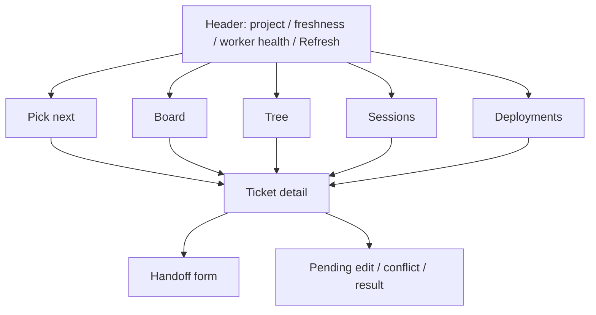

# Session Quill — UI Design Specification

Status: revised draft v0.2 · 2026-10-02
Companions: [PRD](PRD.md), [TRD](TRD.md), [canonical fields](DATA-CONTRACT.md), [acceptance](ACCEPTANCE.md).
Historical PNG wireframes are v0.1 references; the states and layouts below supersede them.

## Purpose and contexts

The dashboard answers “what should I pick next?”, “where was I?” and “what still needs deployment?” for one developer. The local owner UI is editable; exported HTML is read-only for the owner or a teammate. A snapshot is not live and cannot be revoked after distribution.

The owner typically works beside a terminal. Support 1440, 1024, 800 and 390 px layouts without hiding authorized actions solely because the viewport narrows. All five views remain available on small screens.

Local projections update after note materialization; external reconciliation runs every two hours. Requests and handoff progress update independently. Show data age, worker connection and provider errors separately so a recent local update cannot imply fresh PR evidence.

## Principles

1. Show the next action and its reason above the fold.
2. Use calm density, neutral surfaces and labelled status chips; never communicate status by color alone.
3. Show honest freshness and capture health, including never-synced, offline and failed states.
4. Show pending edits separately from confirmed values. Do not claim a save before acknowledgement or conceal a conflict.
5. Use semantic tokens, system fonts, light/dark themes and accessible focus.
6. Read-only is a capability, not a viewport size. Static exports have no mutation controls or local service credentials.

## Information architecture

Five views are tabs; detail preserves the current view, filters and scroll position. A project filter applies globally; other filters are view-specific and reflected in the URL hash. Never serialize secrets or private paths in URLs.

## Data and capabilities

Use [DATA-CONTRACT](DATA-CONTRACT.md) directly; do not create a second list of incompatible database fields. The snapshot supplies tickets, sessions, checkpoints, handoffs, requests, picknext, meta and capabilities. Detail can page the same generation's full content.

- Six workflow statuses: todo, active, blocked, review, deploy-pending, done.
- Stale is an additional flag with an age label, not a column or editable status.
- Session states: live, idle, ended, extinct. Live means recent activity, not a running-process guarantee.
- Request states: pending, applying, applied, conflict, failed, cancelled.
- Handoff states: queued, running, done, failed, cancelled, timed-out.
- Each ticket exposes blocker, full approved-plan/conclusion references, tags, repo display name, PR evidence and per-environment deployments.
- Unauthorized actions are absent. Connection loss disables local mutations with a reason. A request is queued only after the worker acknowledges durable receipt.

## Screens

| Screen | Content | Required states |
| --- | --- | --- |
| Header | Name, global project filter, last sync/next scheduled run, connection and capture health, Refresh, theme toggle | Never synced; fresh; ageing; stale; capture gap; provider error; offline; refresh queued/running/failed |
| Pick next | Up to five ranked cards with reason, raw-score explanation, displayed score, next action and age; separate blocked list with blocker text | Fewer than five; no eligible work; everything blocked; unknown provider evidence |
| Board | Six columns: todo, active, review, deploy-pending, blocked, done; stale badge/filter overlays active cards; done collapsed by default | Empty columns; 40+ cards paged; zero filter results; loading/error |
| Tree | Parents, direct-child completion counts, nested children, unresolved imported links | Empty; orphan; cycles rejected with issue; depth > 3 navigable through detail |
| Sessions | Ticket history/current binding, machine, state, started, successful writes, coverage, checkpoint preview, unpromoted indicator, gate-off indicator | Live/idle/ended/extinct; unbound; rebind; unresolved attribution; capture gap |
| Deployments | Each outstanding merged PR/environment obligation, oldest first; ticket journey strip with evidence dates | Empty; unknown PR state; multiple PRs/environments; pending edit; done ticket with outstanding deployment |
| Ticket detail | Summary, project, status, next action, blocker, timeline, full plans/conclusions, file count, PRs/deployments, follow-ups and handoffs | No sessions; incomplete checkpoint; pending/conflict/failed edit; partial handoff result; validation issue |

Every list displays its count; stale counts are separate from status totals. Relative time has an accessible absolute timestamp in detail and on hover/focus. Ticket keys are monospaced and copyable. An empty state explains what fills it and uses the actual installed command namespace.

Full checkpoint content is available from a preview; truncation never implies the stored record is truncated. Show “Capture incomplete” when full content is unavailable. Work attached to older bindings stays navigable from the session history.

## Components

| Component | Variants and behavior |
| --- | --- |
| Ticket card | Board, Pick next, compact; key/category, title, status/stale badge, metadata; Handoff only on Pick next and detail |
| Status chip | Six labelled statuses; independent stale badge with age |
| Category chip | Six outlined neutral labels with a consistent line icon |
| Priority mark | P0–P3; P0/P1 bold; no color dependency |
| Score badge | 0–100 with reason; explain capped scores and raw-score ordering in expanded detail |
| Session chip | Four labelled states; live pulse optional and never a locking claim |
| Handoff chip | Six states; failure/timeout reason and partial-result link |
| Timeline item | Typed event, timestamp, source and coverage; expandable plans/conclusions; grouped writes |
| Health indicator | Separate sync age, worker connection, capture backlog/gaps and provider health |
| Filter bar | Project, category, tag, repo, machine, stale, search; removable tokens and clear |
| Handoff form | Mode, note, source and action permissions, required prerequisites, Queue |
| Request feedback | Sending, pending, applying, applied, conflict, failed, cancelled; undo only while allowed |

Use one line-icon set at 16 px, no emoji. Nesting a Handoff button inside a card must preserve valid keyboard semantics; use separate focus targets.

## Interactions

1. **Edit next action:** Enter submits; Shift+Enter inserts a line; Escape cancels. Send the current revision. Show Sending until acknowledged, then Pending with a 10 s cancellation window. Keep the confirmed value available while previewing the pending value.
2. **Change status:** Offer six statuses. Blocked requires blocker text in this same action. Choosing done with outstanding deployments requires one explicit choice: record deployment evidence, waive with a reason, or leave deployments outstanding. No silent mark-deployed behavior.
3. **Record deployment:** Select individual PR/environment obligations, timestamp and evidence, or choose waiver with reason. Keep rows visible until confirmed. Status and related deployment changes are one logical request when submitted together.
4. **Undo and conflict:** Worker-enforced not-before makes pending edits cancellable for 10 s. If cancellation lost a race, show the applied outcome and offer a new revision-checked reversal. Conflict shows current and proposed values; user chooses to discard or resubmit against the new revision. Failure preserves the draft and exposes a retry reason.
5. **Refresh:** Submit an immediate reconciliation request. While online, show its queued/running/result state, reusing an existing run if necessary. Do not change fresh data to ageing merely because Refresh was clicked. On failure re-enable retry; while offline disable submission and explain that nothing was queued.
6. **Handoff:** Default to analyse with follow-ups, source off. Attempt fix requires source-read and isolated-edit permission. Commit, push branch and draft PR are separate opt-ins with dependencies shown. No push means local result only. Show prerequisite failure before submission where known; worker revalidates at dispatch.
7. **Handoff lifecycle:** One queued/running handoff per ticket is enforced by worker and UI. Allow cancellation. Show timeout/interruption and preserved partial results; retry creates a new run and does not duplicate previous children. Request accepted is distinct from handoff done.
8. **Export:** Select project scope and included fields, preview exact content, then save. Exclude full checkpoints, local paths and private links by default. Display exported_at and last_sync. Explain that this is a copy that will not update or support revocation. Saving does not automatically upload or message anyone.

Tree is read-only navigation in v1; create children through the CLI or permitted handoff mode. No UI “add child” action.

## Navigation and accessibility

- Keys open ticket detail without changing views. Escape closes detail and restores focus.
- Left/Right navigate records only while the detail navigation control is focused; never intercept text editing.
- / focuses search, 1–5 switch views, h opens Handoff on a focused eligible card, ? opens help. Shortcuts do not run in inputs/contenteditable or while another dialog owns focus.
- Desktop docked detail is non-modal and does not trap focus. Overlay/fullscreen detail is modal, traps focus and returns it on close.
- Every action works by keyboard. Labels accompany icons and color. Announce persisted request outcomes through a polite live region, without announcing every poll.
- Respect reduced motion and system color preference; explicit theme selection can override system preference.
- Text and chips meet measured WCAG AA contrast in both themes; interactive targets at least 32 × 32 px.
- Timestamp and reason text must be available without hover.

## Visual system

Use tokens rather than screen-specific colors. Product name is allowed; exclude company branding and private project examples from public template fixtures.

| Role | Use |
| --- | --- |
| bg, surface, surface-raised | Three surface levels |
| text, text-muted, text-faint | All meet AA contrast on their actual background |
| border, border-strong | Dividers and controls |
| accent | Primary action, selected card, top ranked item |
| status-todo, status-active, status-review, status-deploy, status-blocked, status-done | Labelled workflow chips |
| stale, good, warning, critical | Independent freshness and result states |
| focus | Visible 2 px ring with 2 px offset |

Typography: system UI stack (Inter if available), system monospace for keys/paths; 22 / 17 / 15 / 13 / 11.5 px, line height 1.4, weights 400/600. Use 4 px spacing steps: 4 / 8 / 12 / 16 / 24 / 32. Cards: padding 12, radius 8; chips radius 999; borders 1 px. No gradients; only an overlay panel may have a soft shadow.

Dark surfaces increase in lightness by elevation; choose measured colors rather than numeric inversion. Transitions <= 150 ms; remove transitions and pulse for reduced motion.

## Responsive layout

| Width | Layout | Permissions |
| --- | --- | --- |
| >= 1280 px | Board columns 240 px, docked detail 420 px; horizontal scroll when needed | Owner actions remain available |
| 900–1279 px | Grouped vertical Board list; modal detail 420 px; filter drawer | Owner actions remain available |
| < 900 px | Single column, bottom tabs, grouped Board list, fullscreen detail/form | Owner actions remain available; export is read-only |

Do not promise six visible 240 px columns alongside a 420 px panel at 1440 px. The desktop board uses one horizontal viewport and paginated column contents, avoiding nested vertical scroll areas. Grouped lists and Sessions use vertical scrolling and pagination. Test at 800 px to verify that split-window editing still works.

Tree visually indents up to three levels; deeper nodes remain accessible through a “View children” drill-down, with breadcrumbs, rather than disappearing.

## Deliverables and acceptance

Deliver tokens with measured contrast, the twelve reusable components, all views at 1440 px in both themes, 1024/800/390 px variants for Pick next/Board/detail, and a prototype covering edit-conflict, deployment choice, handoff timeout and read-only export.

Acceptance is shared with [ACCEPTANCE](ACCEPTANCE.md), including:
- First-time viewer finds next action/reason under 10 s; stale state under 3 s.
- Statuses and session states remain understandable without color.
- Full keyboard walkthrough, input-safe shortcuts, correct modal versus docked focus.
- 60 board cards and 200 session rows remain readable with the specified scroll/pagination behavior.
- Every request exposes acknowledgement and terminal outcome; disconnected submissions are not represented as queued.
- Full checkpoint and partial handoff results remain accessible.
- Narrow local owner windows retain actions; exported snapshots have none at any width.
- No private paths, credentials, company branding or mutation channel leak into public export fixtures.
