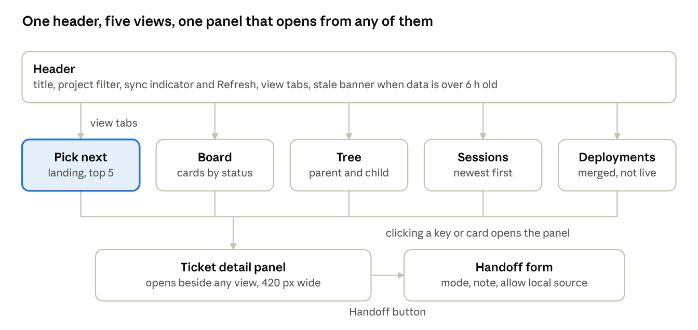
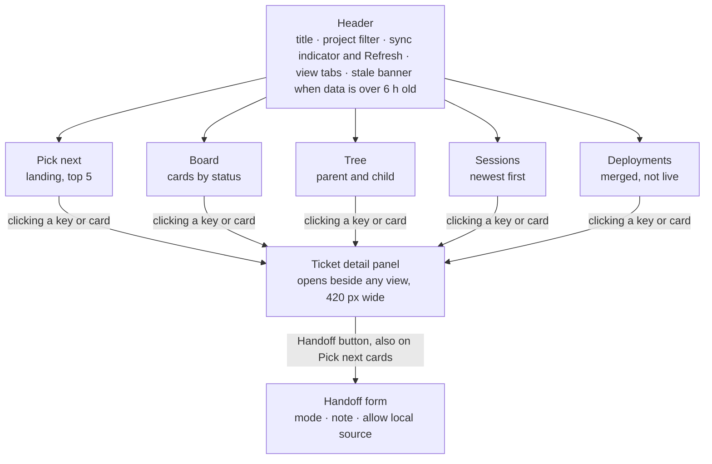
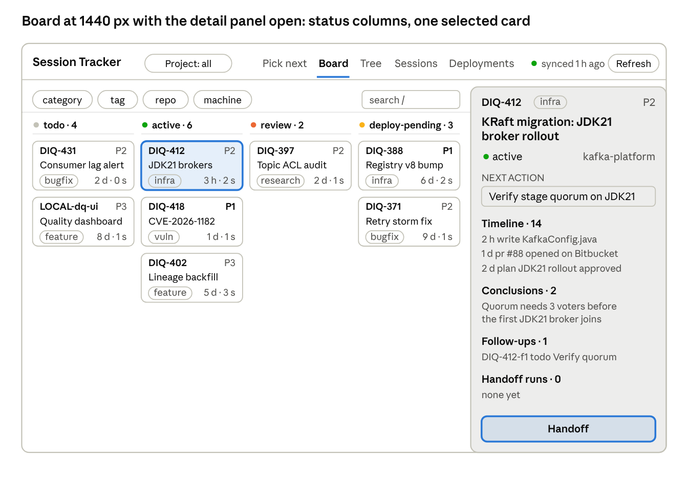

# Session Tracker UI — Design Spec

Status: draft v0.1 · 2026-10-02 · Owner: Shivam
Live doc (editable, with comments): https://claude.ai/code/artifact/5aac569c-9868-4eb4-92eb-b79cf1bf295c
Brief for the person or agent designing the public Session Tracker page; the system behind it is in the [TRD](TRD.md), the product requirements in the [PRD](PRD.md).

## Purpose and users

The Session Tracker page is a developer's personal control board for work done with Claude Code: every ticket, every session that touched it, what was concluded, and what to pick next. One page per user, private by default, shareable with a teammate or manager.

Users and moments:

- Primary: a developer running several Claude Code sessions in parallel, opening the page 3–6 times a day for under a minute each: "what do I pick next", "where was I on X", "did that PR ship".
- Secondary: the same developer in a weekly review, 10–15 minutes, reading conclusions and follow-ups across a project.
- Occasional: a teammate or lead the page was shared with, reading status only; they never edit.
- Non-human: the interval agent writes the data; the handoff agent reads requests the user queues from the page.

Context of use:

- Desktop browser inside the Claude app or a normal tab, usually beside a terminal; 1280–1600 px wide most of the time, occasionally a 1024 px split view.
- Phone, read-only, for a quick status check.
- Light and dark themes, following the system.
- Data refreshes every 2 hours by the agent, not live; the page must make that cadence obvious and never pretend to be real time.

The page is public software, so no company name, product brand or colour belongs in it.

## Design principles

Every screen is judged against these six; when two conflict, the earlier one wins.

1. Answer in one glance. The two questions "what do I pick next" and "what is the status of X" are answered above the fold, without a click. Scores, statuses and ages are visible, not hidden in hover.
2. Calm density. Dozens of tickets and sessions on one screen without noise: one accent colour for the single most important thing on the view, neutral everything else, status carried by a small chip and a word, never by a wall of colour.
3. Honest about time. Every view shows when the data was last synced and visibly degrades when it is stale (older than 6 hours): a quiet banner, muted cards, never a silent old number.
4. Vault is the truth. The page edits very little (next action, status, deployed, handoff). Each edit shows a "queued for next sync" state until the agent confirms it; nothing on the page pretends to have saved to the vault instantly.
5. Brand-neutral and themeable. Semantic colour tokens only, light and dark from day one, system font stack; a user or team can retheme by changing tokens, never by editing screens.
6. Keyboard and screen-reader complete. Every action reachable by keyboard, every chip and badge has a text label, focus is always visible, contrast meets WCAG AA in both themes.

## Information architecture

The header is the only global element: project filter and sync state apply to every view. The five views are tabs, not pages; the detail panel and the handoff form are layers over whichever view is open, so the user never loses their place.

## Data the UI reads

The page reads five collections from its own database, written by the agent; the designer can treat them as fixed. Everything shown on screen comes from these fields, so a field not listed here cannot appear in a design.

| Collection | One row per | Fields the UI uses |
| --- | --- | --- |
| `tickets` | work item | key, title, project, status, category, priority (P0–P3), parent, children[], next_action, last_activity, due, prs[] (url, state), sessions[] (ids), files_touched (count), plans (count), conclusions[] (date, text), timeline[] (date, kind, text), handoffs[] (ids), stale (bool) |
| `sessions` | Claude Code session | id, ticket, project, machine, state (live / ended / extinct), started, ended, writes (count), last_checkpoint (text, 1,500 chars), unpromoted (bool) |
| `handoffs` | handoff run | id, ticket, mode, note, allow_source, status (queued / running / done / failed), requested_at, finished_at, result_link, children[] |
| `picknext` | ranked suggestion | rank (1–5), ticket, score, reason |
| `meta` | single row | last_sync, agent_interval_hours, machine, store_name, tracker_version, counts per status |

Closed sets, each with exactly one visual treatment:

- Status: `todo`, `active`, `blocked`, `review`, `deploy-pending`, `done`, `stale`.
- Category: `feature`, `bugfix`, `vuln`, `infra`, `research`, `analysis`.
- Session state: `live`, `ended`, `extinct`.
- Handoff status: `queued`, `running`, `done`, `failed`.
- Priority: `P0`, `P1`, `P2`, `P3`.

Writes the page may make, each shown as "queued" until the next sync confirms it: `handoffs` (new row), `sync_requests` (refresh now), and three small ticket edits (`next_action`, `status`, `deployed`). Nothing else on the page is editable.

## Screens

Five views under one header, plus a detail panel that opens beside any view. Pick next is the landing view.

| Screen | Purpose | Contents | States to design |
| --- | --- | --- | --- |
| Header | Orientation and trust | Page title, project filter (all or one), last sync with relative time, Refresh button, theme follows system, link to the store (Obsidian URI or folder) | Fresh (under 2 h), ageing (2–6 h), stale (over 6 h, banner), refresh queued |
| Pick next | The daily question | Five ranked cards: rank, key, title, status chip, priority, score with its reason sentence, next action, last activity; below them a Blocked list with the blocker text | Fewer than 5 candidates; nothing open (celebratory empty state, no confetti); everything blocked |
| Board | Status at a glance | Columns per status in the fixed order todo, active, review, deploy-pending, blocked, stale, done; cards with key, title, category chip, priority, last activity, session count, child count; done column collapsed by default | Empty column; 40+ cards in a column (virtualised or paged); filtered to zero |
| Tree | Parent and child work | Parents as rows with progress (3 of 5 children done), children indented one level, collapsed by default; orphans listed last | No parents yet; deep trees (3+ levels, cap display at 3) |
| Sessions | Where was I | Table newest first: ticket, machine, state chip, started, writes, last checkpoint excerpt (2 lines), unpromoted flag | Filter "extinct with unpromoted work" active; a live session (pulsing dot, no animation beyond 1 cycle per 2 s) |
| Deployments | Shipped but not done | Tickets with merged PRs not yet deployed, oldest first, PR links; a journey strip (plan → PRs → deploy) for tickets touched in the last 7 days at the top | No pending deployments; mark-deployed queued |
| Ticket detail (panel) | Everything about one item | Title, key, project, status (editable), priority, next action (editable), timeline, approved plans, conclusions, files touched count, PRs, follow-ups, handoff runs, Handoff button | Loading; ticket with no sessions yet; handoff queued / running / failed |

Rules that apply to every screen:

- The detail panel opens on the right at 420 px without leaving the current view; on narrow widths it becomes a full-screen sheet.
- Every list shows a count in its heading ("Sessions · 23").
- Relative times ("3 h ago", "4 d ago") everywhere, absolute timestamp on hover and in the panel.
- Keys (`DIQ-412`, `LOCAL-kraft-jdk21`) are monospaced and copyable with one click.
- Empty states say what will fill the view and how ("Sessions appear here once a session binds a ticket with /ticket").

## Main layout

Wireframe only: proportions and placement, not final type, colour or copy. Columns continue to the right with one horizontal scrollbar; `done` is collapsed off-screen. The selected card and the Handoff button are the only two accent uses on the screen.

## Components

Twelve components cover every screen; each is designed once with all its variants and reused unchanged.

| Component | Variants | Anatomy and rules |
| --- | --- | --- |
| Ticket card | board, pick-next (adds rank, score, reason, next action), compact (tree child, deployments) | Key (mono) and category chip on line 1, title (2 lines max, then ellipsis) on line 2, meta row (priority, last activity, sessions, children) on line 3; whole card is the click target; no secondary buttons on the card except Handoff on pick-next |
| Status chip | 7 statuses | Dot plus word; the dot carries the status colour, the word is always present; never colour alone |
| Category chip | 6 categories | Outlined, neutral text, a small glyph per category; distinguishable in greyscale |
| Priority mark | P0–P3 | Two-character label; P0 and P1 bold, P2 and P3 regular; no colour |
| Score badge | 0–100 | Number plus a short bar; the reason sentence sits beside it, never only in a tooltip |
| Session state chip | live, ended, extinct | live has a subtle dot pulse; extinct uses the warning tone; ended is neutral |
| Handoff status chip | queued, running, done, failed | running shows an indeterminate ring; failed exposes the reason inline |
| Timeline item | write, commit, pr, plan, conclusion, handoff, status change | Date column, kind glyph, one-line text; conclusions and plans expandable in place |
| Sync indicator | fresh, ageing, stale, refresh queued | In the header; stale also renders a full-width banner above the view |
| Filter bar | project, category, tag, repo, machine, search | Chips with counts; active filters shown as removable tokens; one-click clear |
| Handoff form | sheet or popover | Mode (radio: analyse, analyse + follow-ups (default), attempt fix), note (optional, 280 chars), allow local source (switch, off by default), explanatory line under attempt fix ("works on a branch, never pushes to main"), Queue button |
| Queued-edit state | any editable field | Field shows the new value with a "queued for next sync" tag and an undo for 10 s; clears when the agent confirms |

Glyphs: a single line-icon set at 16 px, one icon per category and timeline kind; no emoji anywhere. Keys and file paths use the monospace face; everything else the UI face.

## Key interactions

Five interactions change data; each follows the same pattern: act, see "queued", see confirmation after the next sync.

1. Handoff a ticket. Handoff button on a card or in the panel → Handoff form → Queue. The card gains a `queued` handoff chip at once. After the agent runs: chip becomes `running`, then `done` with a link to the handoff note and the new child tickets appear in Tree and on the parent's Follow-ups; or `failed` with the reason (usually "machine offline, source required"). One handoff per ticket at a time: while one is queued or running, the button is disabled with that reason.
2. Edit next action. Click the next-action text in the panel → inline textarea (2 lines) → Enter saves, Esc cancels → queued-edit state with undo for 10 s.
3. Change status. Status chip in the panel opens a menu of the 7 statuses; `stale` is not selectable (agent-only); choosing `done` on a ticket with a merged, undeployed PR asks "Mark deployed too?" with Yes / No, never silently.
4. Mark deployed. In Deployments: Mark deployed on a row → queued-edit; the row stays in place, greyed, until the sync confirms, then leaves the list.
5. Refresh now. Header Refresh → button shows "Refresh queued" and is disabled until the next sync lands; the sync indicator turns to "ageing" style while waiting. No spinner that spins for 2 hours.

Navigation and filtering:

- Views are tabs in the header; the current view and filters live in the URL hash so a link opens the same state.
- Project filter is global and persists across views; other filters belong to the view they are set in.
- Clicking a key anywhere opens that ticket's panel without changing the view; Esc closes the panel; Left and Right arrows move to the previous or next ticket in the current list.
- Keyboard: `/` focuses search, `1`–`5` switch views, `h` opens Handoff on the focused card, `?` shows the shortcut sheet.

Motion: 150 ms ease-out for panel open and chip changes, nothing longer; no animated transitions between views; respect `prefers-reduced-motion` by removing the live pulse and all transitions.

## Visual system

The designer defines tokens, not pixels: every colour, size and space below is a named token with a light and a dark value, delivered as a token sheet the page consumes directly.

Colour roles (the designer picks the values; the roles are fixed):

| Role | Used for | Constraint |
| --- | --- | --- |
| `bg`, `surface`, `surface-raised` | page, cards, panel | 3 steps, no more |
| `text`, `text-muted`, `text-faint` | primary, meta, placeholders | AA contrast on `surface` in both themes |
| `border`, `border-strong` | card edges, focus rings base | |
| `accent` | one per view: rank 1 on Pick next, the selected card, primary buttons | the only saturated colour in the default state |
| `status-active`, `status-review`, `status-deploy`, `status-blocked`, `status-stale`, `status-done`, `status-todo` | status chip dots and board column headers | 7 hues distinguishable to deuteranopia; each also carries its word |
| `good`, `warning`, `critical` | sync fresh / ageing / stale, handoff done / running / failed, extinct sessions | conventional green / amber / red, desaturated for dark |
| `focus` | keyboard focus ring | 2 px, offset 2 px, visible on every surface |

Typography: one UI face (system stack: Inter if present, else the platform sans) and one monospace face (system mono) for keys, paths and commands. Scale: 22 / 17 / 15 / 13 / 11.5 with 1.4 line height; 13 is body, 11.5 is meta, nothing smaller. Weights: 400 and 600 only.

Spacing and shape: 4 px base, spacing steps 4 / 8 / 12 / 16 / 24 / 32; card padding 12; card radius 8, chip radius 999; 1 px borders, no shadows except the open detail panel (one soft shadow); no gradients.

Density: a board card is 3 lines tall (about 84 px); a sessions row is 2 lines (about 56 px); at 1440 px the board shows 6 columns of 240 px with one scrollbar at most.

Dark theme: not an inversion. Surfaces step up in lightness as they rise; status hues are desaturated 20–30 %; borders lighten rather than darken; the accent keeps its hue but drops saturation so it does not glow.

Accessibility checklist: WCAG AA for all text and chips in both themes; status never by colour alone; all icons have text labels or `aria-label`; focus order follows reading order; panel traps focus while open and returns it on close; live region announces "queued" and "synced" changes; all targets at least 32 × 32 px; `prefers-reduced-motion` and `prefers-color-scheme` honoured.

## Responsive behaviour

Three breakpoints; the content is the same at all of them, only the layout changes.

| Width | Layout | What changes |
| --- | --- | --- |
| 1280 px and up (desktop) | Header, view, detail panel side by side; board columns at 240 px, horizontal scroll past 6 | Nothing hidden |
| 900–1279 px (laptop or split view) | Panel overlays the view at 420 px with a scrim; board columns at 220 px | Filter bar collapses to a Filters button with a count |
| Under 900 px (phone, read-only) | Single column; views in a bottom tab bar; panel is a full-screen sheet; board becomes a status-grouped list | Handoff, edits and Refresh hidden; a one-line note says "editing on desktop" |

The page is used beside a terminal more often than full screen, so the 1024 px case is the one to test first.

## Deliverables and acceptance

What the designer hands back, in this order, so each piece can be reviewed before the next starts.

1. Token sheet: every colour role in light and dark with contrast ratios, type scale, spacing, radii, as JSON or a Figma variables export.
2. Component library: the twelve components with all variants and states, including focus and reduced-motion.
3. Screens at 1440 px, light and dark: Pick next, Board with the panel open, Tree, Sessions, Deployments, Ticket detail, Handoff form, plus the stale banner and three empty states.
4. Screens at 1024 px and at 390 px for Pick next, Board and Ticket detail.
5. A clickable prototype of interaction 1 (handoff) and interaction 3 (status change with the deployed prompt).
6. Redlines or a short spec per screen: spacing, sizes, truncation rules.

Acceptance criteria, checked on the prototype:

- [ ] A first-time viewer finds what to pick next and why within 10 seconds, without instructions.
- [ ] Every status, category and session state is identifiable with colour removed.
- [ ] All text and chips pass WCAG AA in both themes (measured, not estimated).
- [ ] The stale state is noticed within 3 seconds of opening the page.
- [ ] Every data-changing action shows its queued state and its confirmation.
- [ ] Board with 60 cards and Sessions with 200 rows stay readable and scroll in one axis only.
- [ ] Full keyboard walkthrough of the five interactions with visible focus throughout.
- [ ] No brand, product name or company colour anywhere in the screens.

## Open questions for the designer

- [ ] Tool name and wordmark: `Session Tracker` is the working name; propose one or two alternatives with a simple mark that works at 16 px.
- [ ] Board versus list as the default for Board on laptop widths: columns at 220 px or a grouped list?
- [ ] Score display: number plus bar, or rank only with the reason sentence? Test both on Pick next.
- [ ] Timeline density in the panel: show all events or collapse writes into "12 files edited" with expand?
- [ ] Should the phone layout include Pick next only, or all views read-only?
- [ ] Theme switch in the header, or system-only?
